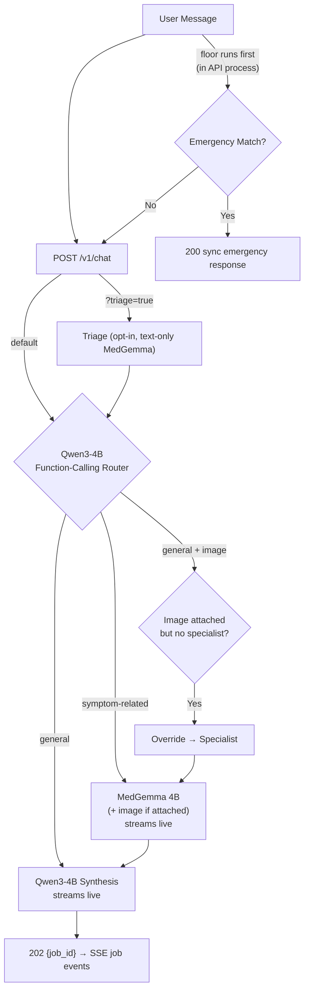

# MedGemma Agent

A FastAPI chat backend for a clinical-assistant agent, backed by local models
served via Ollama. Every chat turn runs through a Celery worker (Redis broker),
streams both the clinical assessment and the final reply token-by-token over
Server-Sent Events, persists sessions/messages/audit to PostgreSQL, and layers
a deterministic emergency floor plus always-on output guardrails under an
opt-in triage classifier. Clinical capabilities are pluggable **add-ons**
registered in a neutral registry — the core runtime never imports them — and a
React/Vite chat frontend ships alongside.

## Models

| Model | Env var | Role |
|---|---|---|
| **Qwen3-4B** | `MODEL_NAME` | Orchestrator / router / plain-language synthesis |
| **MedGemma 4B** (`medgemma1.5:4b`) | `SPECIALIST_MODEL_NAME` | Clinical specialist note (streamed); multimodal tier for image analysis |
| **MedGemma 4B** (`medgemma1.5:4b`) | `TRIAGE_MODEL_NAME` | Opt-in triage classifier — **text-only**, schema-constrained |
| **Qwen3-0.6B** | `GUARD_MODEL_NAME` | Output-guardrail judge (always on; skips replies < `GUARD_MIN_CHARS`) |

Plus a deterministic, non-model red-flag safety floor that runs on every turn.

## Conversation flow

```
User → Safety floor → [opt-in triage ?triage=true] → Qwen function-calling router → routed add-on (streamed) → Qwen synthesis (streamed) → SSE result
```



## Safety floor

A deterministic, non-model red-flag check runs **on every user turn** before any
model is called — independent of the triage opt-in. If it matches, the turn
short-circuits synchronously (`200`, never queued) with a fixed emergency
response. The emergency decision never depends on any model.

Current red-flag categories:

```
chest pain, breathing difficulty, stroke signs, suicidal ideation,
severe bleeding, anaphylaxis signs, seizure, unconsciousness
```

This is a reviewed-clinical-artifact placeholder and should be refined with
clinical input.

## Triage

Triage is **off by default** and opt-in per request via `?triage=true`. The
classifier is MedGemma 4B, **text-only**: image bytes are never sent to triage;
they ride only to the specialist during analysis. The call is constrained by a
JSON-schema `format` to `{"urgency": "emergency" | "urgent" | "routine" |
"self_care"}`.

When enabled, the resulting urgency is injected into routing and synthesis
context so the reply is calibrated to it, and a `triage_result` pipeline event
is recorded. Urgency is a typed enum (`Urgency` in `app/domain/triage.py`);
malformed model output raises rather than being silently coerced — the pipeline
degrades to no triage signal instead of a wrong urgency.

### Standalone triage endpoint

`POST /v1/triage` exposes the classifier directly — stateless, no session, no
synthesis. The deterministic red-flag floor runs first: a match short-circuits
to a structured emergency result with zero model calls. Responses carry
`source` (`rules` or `text`) and, for image turns, an `image` metadata block —
the image is stored and audited but never classified.

## Output guardrails

Every outgoing reply is judged by the small guard model (`GUARD_MODEL_NAME`)
against five violation categories: definitive diagnostic claims, missing
disclaimers, emergency-path bypasses, contradictions with structured triage,
and unsafe wording. Verdicts map to deterministic fixes (append a fixed safety
note or replace with the emergency directive), so the model decides *whether*
something is wrong — never *how* to fix it. Always on regardless of the triage
opt-in; the LLM call is skipped deterministically for replies shorter than
`GUARD_MIN_CHARS`.

## Routing

Routing is **contextual and registry-driven**: Qwen decides whether a turn needs
a clinical capability by choosing among the tool schemas of every *enabled*
add-on, using the full conversation rather than keywords. The routing prompt is
generated from the registry (`build_routing_prompt`), so registering or
disabling an add-on changes what the router sees with no code changes:

- **Tool called** → that add-on runs its streamed extraction stage (its own
  model via `model_setting`, its own JSON wire schema via `format_schema`);
  `parse()` turns the raw output into a typed result and `context_for()` renders
  it into Qwen's synthesis context for the final reply.
- **`/tool` mention** → an explicit `/addon_name` token takes the turn off the
  conversational flow entirely (`path=direct_tool`): the router LLM is skipped
  (recorded as `slash_override` + `router_skipped`), the optional triage stage
  and chat history are left out, and only the named add-on runs. Qwen still
  enunciates the tool result — from the addon's dataset-backed phrasing where
  provided (`deterministic_reply`), otherwise a focused synthesis over the
  result alone. Unknown or disabled names are ignored and routing proceeds
  normally. The emergency floor still runs first — a slash mention can never
  bypass safety.
- **No tool call** → Qwen replies directly (single model call). **Exception:** if
  the turn carries an image, the decision is deterministically overridden to the
  first *enabled* add-on declaring `accepts_images = True`. Recorded as
  `image_override`.
- **GENERAL + keyword trigger** → an add-on's optional conservative
  `route_trigger` hook can force dispatch (recorded as `keyword_override`),
  so stale-history drug mentions still reach the interaction checker.

The router can only produce `general` or `symptom_related`; emergencies are
owned exclusively by the hardcoded safety check, which runs first and
short-circuits before any model call.

## Add-ons

Clinical capabilities live in `app/addons/` as single-file plugins exposing a
module-level `addon` instance. At boot, `bootstrap_addons()` scans the folder,
registers every instance in the neutral registry (`app/registry/`), and wires
the per-session toggle store — the composition root (`app/bootstrap.py`) is the
only application module allowed to know add-ons exist.

The dependency rule is enforced: `app < registry < addons`. Nothing outside the
bootstrap may import `app.addons`, and the registry layer imports nothing from
the application. `make check-arch` fails on violations.

Required contract (structural — no base class): `name`, `tool_schema`,
`system_prompt`, `safety_profile`, `model_setting`, `format_schema`, plus
`parse()` and `context_for()`. Optional hooks are probed dynamically:
`deterministic_extract` / `deterministic_reply` (skip LLM stages),
`route_trigger` (receives `has_image=` so vision-bound add-ons never claim a
text-only turn), `image_route_hint` (wins the image override over the
first-capable fallback), `unavailable_reply` (fault-isolation reply when the
add-on raises mid-turn), and `accepts_images`. Setting `structured_kind`
additionally emits the parsed result as a dedicated structured payload: an
`event: structured` SSE frame, a field on the turn result, and a persisted
JSONB column on the assistant message — so clients render it as its own card,
across refreshes.

Four archetypes ship as reference implementations: LLM-stage assessment
(`clinical_assessment.py`), lightweight classifier (`symptom_triage.py`),
dataset-backed deterministic lookup (`medication_interaction.py`), and
vision transcription with derived uncertainty plus deterministic interaction
cross-checks (`prescription_reader.py`).

To add one: drop a file in `app/addons/`, expose `addon`, restart API + worker.
Duplicate tool names are rejected loudly at registration.

Per-session toggles are API-managed:

```sh
curl "http://localhost:8000/v1/addons?session_id=3f2a..."          # list w/ enabled state
curl -X POST "http://localhost:8000/v1/addons/check_medication_interaction?session_id=3f2a..." \
  -H "Content-Type: application/json" -d '{"enabled": false}'      # disable for this session
```

A disabled add-on disappears from the router's offered tools on the very next
turn; the emergency floor is not an add-on and can never be toggled.

### Prescription reading

`prescription_reader.py` turns an uploaded prescription photo or PDF into a
structured medication list. Routing is hint-based: prescription language on an
image-bearing turn dispatches here even when another vision add-on would win
the first-capable fallback, and its `route_trigger` never claims a text-only
turn. MedGemma transcribes into an enforced wire contract —
`{"medications": {"<name>": {strength, dose, frequency, duration,
instructions}}}` with nulls for anything illegible — and every null field is
deterministically turned into a clarification ask (never guessed): asks appear
in the reply, in the structured payload's `clarifications`, and as the amber
"Needs your input" section of the frontend card. Each extracted drug pair is
cross-checked against the curated interaction dataset (first 8 medications,
with an explicit truncation note beyond that); pairs without a dataset entry
surface a plain "nothing can be concluded either way". Patient/prescriber
identity visible in the document is never extracted, phrased, or logged.

### Reply sanitization

Qwen3 sometimes prefixes its reply with a reasoning preamble and wraps the real
answer in `<response>...</response>` tags. `extract_answer` strips that and
returns the clean reply; during streaming, `StreamExtractor` strips the wrapper
live so only clean text is forwarded as tokens. When the tags are absent but a
deliberation preamble ends in an explicit `Response:` / `Answer:` / `Reply:`
marker (e.g. the function-calling router reasoning about its own tool choice),
everything up to the marker is stripped as well — model meta-reasoning never
reaches the user.

## Image handling

Images arrive base64-encoded (`image_b64` + `image_mime`) and pass through a
sanitization gate (`app/core/images.py`) before anything else sees them:

1. **Decode** — raw base64 or `data:` URLs; size capped at `IMAGE_MAX_BYTES`.
2. **Mime allowlist** — `IMAGE_ALLOWED_MIME` (default JPEG/PNG/WebP/PDF); the
   declared mime must match the decoded content.
3. **PDF first page** — `application/pdf` uploads are rendered to a raster of
   their **first page only** via pypdfium2 (oversized pages rejected, render
   scale capped) before continuing through the normal image path. Multi-page
   documents are audited (`source_pages`) and the limitation is disclosed in
   the reply.
4. **Pillow verify + re-encode** — structural verification, then a clean JPEG
   re-encode (quality 85) that strips EXIF metadata (including GPS), flattens
   alpha onto white, and downscales to `IMAGE_MAX_DIMENSION_PX`.

Sanitized images are persisted to `IMAGE_UPLOAD_DIR` (filename = `turn_id`),
referenced by the stored user message, and audited (metadata only — path,
sha256, mime, size; never bytes). Validation failures surface as HTTP `422`.
An invalid or partial image pair is rejected at enqueue time, before the queue
is involved.

## Project layout

```
app/
  main.py            # FastAPI app factory + lifespan (bootstrap_addons, session close)
  api/
    routes.py        #   all HTTP endpoints (chat/jobs/triage/addons/sessions/audit/config)
    schemas.py       #   request/response models
  chat/
    turn.py          #   run_chat_turn / run_emergency_turn pipeline
    routing.py       #   RouteCategory / RouteDecision / parse_tool_calls
    triage.py        #   run_triage dispatch
  domain/
    specialist.py    #   SpecialistResult + parser (shared result contract)
    triage.py        #   TriageResult / Urgency + parser (shared result contract)
  registry/          # neutral add-on layer: Addon protocol, ToolSchema, SafetyProfile,
                     #   in-memory registry, settings-store port (imports no app code)
  addons/            # pluggable capabilities + curated data (auto-scanned at boot)
  bootstrap.py       # composition root — sole importer of app.addons
  persistence/       # SQL adapter implementing the registry settings-store port
  worker.py          # Celery app + process_turn task (token/pipeline event callbacks)
  jobs.py            # Redis job registry + event buffer (mark_enqueued, append_event, broker_ping)
  audit.py           # append-only audit logger (JSONL file + Postgres, always both)
  core/              # config, db, models, context trimming, image gate, logging
  llm/               # LLMClient (OpenAI-compat + native APIs + streaming) + parsing
  safety/            # deterministic red-flag floor + invariants + output guardrails
  prompts/           # loader + templates/, composed prompts, JSON wire formats
  sessions/          # store contract + Postgres implementation + manager
alembic/             # migration scripts (autogenerated from app/core/models.py)
frontend/            # React 19 + Vite + Tailwind v4 chat UI
```

## Prerequisites

- Ollama running with the models pulled:

  ```sh
  ollama pull qwen3:4b
  ollama pull medgemma1.5:4b
  ollama pull qwen3:0.6b
  ```

- PostgreSQL reachable at `DATABASE_URL` — sessions, messages, and the audit
  trail are Postgres-only.
- Redis reachable at `REDIS_URL` — Celery broker/result backend and the
  replayable job-event buffers.

## Setup

```sh
python3 -m venv .venv
.venv/bin/pip install -r requirements.txt
cp .env.example .env   # then edit; the app loads it via python-dotenv
```

## Run

Both processes are required for chat: the API enqueues, the worker processes.

```sh
make up         # whole stack detached: API + worker + frontend (:5173)
make api        # uvicorn app.main:app --port 8000
make worker     # celery -A app.worker:celery worker --concurrency=1
make frontend   # vite dev server on :5173 (proxies /v1/* and /health)
make stop       # stop everything started by make
make check-arch # fail on any app→addons or registry→app import edge
```

All targets are non-blocking: processes run detached with pid files and logs
under `app/logs/` (`api.log`, `celery.log`, `frontend.log`); re-running a start
target is a no-op while its component is alive.

Worker concurrency comes from `JOB_CONCURRENCY` (default 1); raising it lets
multiple turns hit Ollama in parallel, but GPU/VRAM is the real ceiling.
`GET /health` reports `{"api": true, "redis": true}` — redis `false` means the
broker is down and jobs will sit enqueued.

The React/Vite UI streams every turn through the job-events SSE channel,
offers a per-message triage toggle, renders structured add-on payloads as
their own cards (e.g. the prescription transcription card with its
clarification prompts, restored across refreshes), and ships a Logs page over
`GET /v1/audit` (module filters, session filter, expandable payloads). `VITE_BACKEND_URL`
points the dev proxy at a non-default API origin; `VITE_API_BASE_URL` (build
time, default same-origin) points a production build (`npm run build`) at a
backend on another origin.

## Use

Every non-emergency turn returns `202 Accepted` immediately:

```sh
curl -X POST http://localhost:8000/v1/chat \
  -H "Content-Type: application/json" \
  -d '{"message": "I have a mild headache. Should I worry?"}'
```

```json
{"job_id": "8f2a...", "session_id": "3f2a...", "status": "queued"}
```

Stream pipeline events, the clinical note, and the reply live:

```sh
curl -N http://localhost:8000/v1/jobs/8f2a.../events
```

Or poll instead:

```sh
curl http://localhost:8000/v1/jobs/8f2a...
```

```json
{
  "job_id": "8f2a...",
  "status": "success",
  "result": {
    "session_id": "3f2a...",
    "response": "...",
    "urgency": null,
    "events": [],
    "path": "medical_specialist"
  }
}
```

Opt into triage for a single turn:

```sh
curl -X POST "http://localhost:8000/v1/chat?triage=true" \
  -H "Content-Type: application/json" \
  -d '{"message": "I have a mild headache. Should I worry?"}'
```

Attach a photo (goes to the specialist; never to triage). PDFs are accepted
too (`image_mime: "application/pdf"` — first page only):

```sh
curl -X POST http://localhost:8000/v1/chat \
  -H "Content-Type: application/json" \
  -d "{\"message\": \"Look at this rash on my arm.\", \"image_b64\": \"$(base64 -w0 rash.jpg)\", \"image_mime\": \"image/jpeg\"}"
```

An emergency phrase short-circuits synchronously — no queue:

```json
{
  "session_id": "3f2a...",
  "response": "...",
  "urgency": "emergency",
  "events": [{"module": "safety", "event_type": "safety_override", ...}],
  "path": "emergency_override"
}
```

## Endpoints

| Method | Path | Description |
|---|---|---|
| `POST` | `/v1/chat` | Enqueue a chat turn (optionally with an image, optionally `?triage=true`). Creates a session if `session_id` is omitted. Returns `202` + `job_id`; emergency matches return `200` with the full response. |
| `GET` | `/v1/jobs/{job_id}` | Poll a job's status and result. |
| `GET` | `/v1/jobs/{job_id}/events` | SSE stream: pipeline events, streamed specialist note, streamed reply, terminal `result`/`error`. Replayable via `Last-Event-ID`. |
| `POST` | `/v1/triage` | Stateless triage classification (text-only model; images stored+audited but not classified). No session, no synthesis. |
| `GET` | `/v1/addons` | All registered add-ons; pass `?session_id=` for per-session toggle state. |
| `POST` | `/v1/addons/{name}` | Enable/disable one add-on for a session (`?session_id=` required). |
| `GET` | `/v1/sessions/recent` | All conversations with last-reply previews (all-chats switcher). |
| `GET` | `/v1/sessions/{id}/messages` | Full persisted conversation for a session, oldest first (history restore). |
| `GET` | `/v1/audit` | Read-only audit-trail listing (`?id=<session_id>&limit=`), newest first. |
| `DELETE` | `/v1/sessions/{session_id}` | Reset a session (clears its history). |
| `GET` | `/health` | Liveness: `{"api": true, "redis": true}` (unversioned). |

### `POST /v1/chat`

Query params: `triage` (bool, default `false`).

Request:

```json
{
  "message": "string (required, non-empty)",
  "session_id": "string (optional)",
  "temperature": 0.7,
  "image_b64": "string (optional, base64, no data: prefix)",
  "image_mime": "string (optional, required with image_b64)"
}
```

Response `200` (emergency floor matched — synchronous, never queued):

```json
{
  "session_id": "string",
  "response": "string",
  "urgency": "emergency",
  "events": [{"module": "safety", "event_type": "safety_override", ...}],
  "path": "emergency_override"
}
```

Response `202` (enqueued):

```json
{"job_id": "string (Celery task id)", "session_id": "string", "status": "queued"}
```

Errors:

| Status | When |
|---|---|
| `422` | `message` missing/empty, `temperature` out of range, empty-string `session_id`, or the image fails validation (too large, unsupported mime, corrupt data, or `image_b64`/`image_mime` partially supplied). |
| `410` | A supplied `session_id` is unknown. |
| `503` | The job queue is unavailable. |

### `GET /v1/jobs/{job_id}`

| Status | HTTP | When |
|---|---|---|
| `pending` / `processing` | `200` | Queued or started but not finished. |
| `success` | `200` | Turn completed; `result` holds the full response incl. `path`. |
| `failure` | `200` | Model-server failure after retries exhausted; `error` starts with `model-server-`. |
| any other failure | `500` | Non-model-server error (bug/expired session mid-flight). |
| unknown id | `404` | Never enqueued and no stored result. |

### `GET /v1/jobs/{job_id}/events`

Server-Sent Events stream (`text/event-stream`). Every frame uses a named
event; each frame also carries an `id:` line (buffer index) for
`Last-Event-ID` replay, so late or reconnecting clients never miss events.

| Event | Payload | Meaning |
|---|---|---|
| `pipeline` | `AuditEvent` | An audit event as each stage completes: `image_received`, `triage_result`, `routing_decision`, `specialist_output`, `turn_completed` (or `safety_override`). |
| `specialist_token` | `{"type": "specialist_token", "content": "..."}` | A delta of the MedGemma clinical note while it is being written (the longest stage) — raw format-constrained JSON streaming live. |
| `structured` | `{"type": "structured", "kind": "...", "data": {...}}` | A parsed add-on result delivered as its own typed payload (e.g. `kind: "prescription"` card data with `medications` + `clarifications`), emitted before the reply when the dispatched add-on sets `structured_kind`. |
| `token` | `{"type": "token", "content": "..."}` | A delta of the final reply. |
| `result` | full response object | Turn finished successfully. |
| `error` | `{"error": "..."}` | Turn failed. |

Events are buffered in Redis (`medgemma:job-events:{job_id}`, same TTL as job
results) by the worker as they happen. The stream drains the buffer
incrementally and terminates after `result` or `error`; because task completion
is ordered after every append, a final buffer flush guarantees nothing is cut
off by the terminal event.

### `POST /v1/triage`

Request:

```json
{
  "message": "string (required, non-empty)",
  "image_b64": "string (optional)",
  "image_mime": "string (optional)"
}
```

Response `200`:

```json
{
  "urgency": "emergency | urgent | routine | self_care",
  "red_flags": ["..."],
  "reasoning": "string",
  "limitations": ["..."],
  "text_findings": [],
  "image_findings": [],
  "body_part": null,
  "body_part_confidence": null,
  "model": "medgemma1.5:4b",
  "source": "rules | text",
  "image": {"path": "...", "sha256": "...", "mime": "...", "size_bytes": 0} | null
}
```

The model emits only `urgency` (schema-constrained); the remaining fields are
structural defaults except on a `rules` short-circuit, which fills `red_flags`
and `reasoning`. Images are stored and audited but never classified. Errors:
`422` validation/image, `502`/`503` model server.

### `GET /v1/audit`

Read-only view of the durable audit trail (Postgres `audit_events`), newest
first. Query params: `id` — a session id to scope the listing to one
conversation; `limit` — page size, default 50, capped at 500 (`422` outside
1–500). Omitting `id` returns the latest events across all sessions.

```sh
curl "http://localhost:8000/v1/audit?id=3f2a...&limit=5"
```

```json
{
  "events": [
    {"id": 30, "module": "job", "event_type": "job_completed",
     "payload": {...}, "session_id": "3f2a...", "turn_id": "...",
     "created_at": 1755000000.0}
  ]
}
```

### `DELETE /v1/sessions/{session_id}`

| Status | When |
|---|---|
| `204` | Session was reset (history cleared). |
| `404` | No session with that id exists. |

## Turn processing

All turns run through Celery (Redis broker **and** result backend):

1. The deterministic safety floor runs **synchronously** in the API process
   before enqueueing. An emergency match short-circuits with `200` and never
   touches the queue.
2. Otherwise `POST /v1/chat` resolves the session (creating and pre-persisting
   new ones so the returned `session_id` is what the worker loads), validates
   images, and enqueues the turn with its `triage` flag.
3. The worker calls the same `run_chat_turn` used everywhere else, forwarding
   pipeline events and token deltas into the Redis event buffer as they happen.
4. Clients watch `GET /v1/jobs/{id}/events` (or poll `GET /v1/jobs/{id}`).

### Retry policy

Transient model-server failures — unreachable, timeout, `502`/`503` — are
retried automatically via Celery's `autoretry_for` with exponential backoff and
jitter, up to `JOB_MAX_RETRIES`. Other HTTP statuses (e.g. `400`, `500`) and
non-LLM errors fail permanently without retrying.

### Job results

Task results are stored in the Redis result backend with a
`JOB_RESULT_EXPIRE_SECONDS` TTL (`result_expires`). Job results are a
short-lived transport artifact and are **not** a substitute for the append-only
audit trail, which remains the durable record of every turn. A registry key
(`medgemma:job:{job_id}`, same TTL) distinguishes a job that exists but is still
pending from one that never existed — this is also how the API decides between
`404` and `pending`.

## Session lifecycle

Sessions and messages live in PostgreSQL (append-only messages, full history
retained — nothing is trimmed from storage). Conversations are permanent:
nothing ages out, so every past chat stays viewable and continuable.

- **Creation** — omitting `session_id` starts a fresh session and returns its id.
- **Continuation** — passing an existing `session_id` loads its history, no
  matter how old it is. Unknown ids get `410 Gone`.
- **Reset** — `DELETE /v1/sessions/{id}` clears history; reuse of the id then
  returns `410`.

Context-window caps apply at send time (what the model sees), never to storage:

| Cap | Env var | Default | Scope |
|---|---|---|---|
| Model context | `MAX_CONTEXT_MESSAGES` | `20` | Max messages sent to the model each turn. |
| Char budget | `MAX_CONTEXT_CHARS` | `16000` | Max characters sent to the model each turn. |

Trimming keeps user/assistant pairs intact and always retains at least the
current turn.

## Migrations

The schema is owned by **SQLModel** models in `app/core/models.py` and managed
with **Alembic**. Schema changes are made to the models, then autogenerated:

```sh
alembic revision --autogenerate -m "describe change"
alembic upgrade head
```

The app does **not** migrate on startup — run `alembic upgrade head` manually
after pulling schema changes.

## Audit logging (JSONL file + PostgreSQL)

**Every transaction appends an immutable record to the JSONL audit file**
(`AUDIT_FILE`, default `app/logs/audit.jsonl`) **and mirrors it to the Postgres
`audit_events` table** — both sinks are unconditional; there is no toggle. Events
are tied to session and turn and carry a module identifier:

| Module | Event | Captured |
|---|---|---|
| `safety` | `safety_override` / `output_guardrail` | Red-flag escalations; guardrail verdicts + deterministic fixes |
| `image` | `image_received` | Sanitized image metadata — never the bytes |
| `triage` | `triage_result` | Urgency classification + duration (only on `?triage=true`) |
| `router` | `routing_decision` | Category, reason, tool calls, `image_override` flag |
| `specialist` | `specialist_output` | Structured MedGemma assessment + model |
| `chat` | `turn_completed` | Final response + temperature + model + path |
| `session` | `session_created` / `session_reset` | Session lifecycle |
| `job` | `job_started` / `job_enqueued` / `job_completed` / `job_failed` | Job lifecycle |

LLM-generated content is trimmed to `AUDIT_LLM_CAP_CHARS` (default `1000`)
before persisting. The trail is append-only by construction (JSONL `O_APPEND` +
lock; Postgres `INSERT`s only). Sink failures are logged but never break a
transaction.

## Structured logging

All logs go through **structlog** and every line is emitted three times:
human-readable on the terminal (colored only on a real TTY), to the rotating
`app/logs/app.log` (the same human-readable rendering, always color-free —
the durable copy of what the terminal shows), and as one JSON object per line
in `app/logs/app.jsonl` (rotating). Uvicorn, Celery, and HTTPX events share
the formatter; `session_id` / `turn_id` / `job_id` are bound per turn/job.

The JSONL stream is self-contained: every audit transaction is mirrored into
it as an `audit.event` record (`module`, `event_type`, full `payload`,
`session_id`, `turn_id`) and session lifecycle transitions emit their own
records (`session.created`, `session.loaded`, `session.saved`,
`session.missing`, `session.reset`, `session.reset_missing`). `app.jsonl`
alone reconstructs every transaction end-to-end; `audit.jsonl` and Postgres
remain the dedicated append-only audit sinks.

## Configuration

Everything lives in `.env.example`; copy to `.env` and adjust:

| Variable | Default | Description |
|---|---|---|
| `MODEL_NAME` | `qwen3:4b` | Orchestrator/router/synthesis model. |
| `SPECIALIST_MODEL_NAME` | `medgemma1.5:4b` | Clinical specialist model (multimodal). |
| `TRIAGE_MODEL_NAME` | `medgemma1.5:4b` | Triage classifier — text-only; images are held back. |
| `GUARD_MODEL_NAME` | `qwen3:0.6b` | Output-guardrail judge. |
| `GUARD_MIN_CHARS` | `200` | Skip the guard LLM call for shorter replies. |
| `OLLAMA_BASE_URL` | `http://localhost:11434` | Ollama server. |
| `LLM_TIMEOUT_SECONDS` | `120` | Timeout for model calls. |
| `IMAGE_MAX_BYTES` | `5242880` | Max accepted upload size (5 MB) pre-sanitization. |
| `IMAGE_ALLOWED_MIME` | `image/jpeg,image/png,image/webp,application/pdf` | Mime allowlist for uploads (PDFs render first page only). |
| `IMAGE_UPLOAD_DIR` | `app/data/uploads` | Sanitized image persistence directory. |
| `IMAGE_MAX_DIMENSION_PX` | `1024` | Longest edge after downscale. |
| `DATABASE_URL` | `postgresql:///medgemma-agent` | Postgres connection (sessions/messages/audit). |
| `REDIS_URL` | `redis://localhost:6379/0` | Celery broker/result backend + event buffers. |
| `MAX_CONTEXT_MESSAGES` | `20` | Messages sent to the model per turn. |
| `MAX_CONTEXT_CHARS` | `16000` | Char budget for the model context. |
| `AUDIT_FILE` | `app/logs/audit.jsonl` | Append-only JSONL audit trail. |
| `AUDIT_LLM_CAP_CHARS` | `1000` | Trims LLM-generated content in audit records. |
| `JOB_RESULT_EXPIRE_SECONDS` | `3600` | TTL for job results and event buffers in Redis. |
| `JOB_MAX_RETRIES` | `3` | Retries for transient model-server failures. |
| `JOB_CONCURRENCY` | `1` | Worker concurrency; GPU/VRAM is the real ceiling. |

There are deliberately no env toggles for fundamental behavior: Celery-only
processing, Postgres-only storage, always-on audit/guardrails, and opt-in
triage are properties of the code, not configuration.

## System boundary

The system prompt pins the assistant's role:

> I'm not a diagnostic tool; for anything urgent, contact emergency services.

## Architecture guard

```sh
make check-arch
```

`scripts/check_architecture.py` (AST-level) enforces the layering that makes
add-ons safe to change: no module outside `app/bootstrap.py` may import
`app.addons`, and nothing under `app/registry/` may import another `app.*`
package. The registry layer is the stable contract both sides depend on —
the core runtime dispatches against the `Addon` protocol without ever
importing a concrete add-on, so adding, editing, or deleting add-ons can
never ripple into application code.

## Scope

Known accepted gaps: job lookups/events 404 after the Redis TTL expires (runs
are ephemeral; the audit trail is the durable record), no dead-letter queue, no
push/websocket channel beyond the SSE stream, concurrency capped by
`JOB_CONCURRENCY` (GPU-bound), no authentication layer yet. Image handling stays
conservative: size/mime caps, metadata-stripping re-encode, bytes never returned
to clients, no DICOM.
