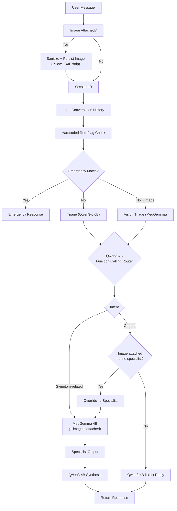

# MedGemma Agent

A FastAPI chat backend for a clinical-assistant agent, backed by three local
models served via Ollama. It provides contextual routing through function
calling, deterministic emergency safety, typed four-level triage with a
multimodal vision tier for photos of visual symptoms, PostgreSQL persistence
with an append-only audit trail, optional Celery-backed worker queues that
move inference off the HTTP request/response cycle, and a token-streaming
React/Vite chat frontend with scannable urgency UI.

**Milestone 7** — Image input for visual symptoms: `POST /v1/chat` and
`POST /v1/triage` accept a base64 image (`image_b64` + `image_mime`). Images
are sanitized with Pillow (size/mime caps, EXIF strip, re-encode), persisted
to disk, audited, and dispatched to the multimodal MedGemma tier for both
triage and the specialist note. An attached image can never be dropped by
routing: if the router does not call the specialist, the decision is
deterministically overridden so the image always reaches MedGemma. All
endpoints now live under `/v1`, and the SSE stream is never silent — it emits
pipeline events, live specialist-note tokens, reply tokens, and empty-token
heartbeats whenever nothing else is ready.

## Models

| Model | Role |
|---|---|
| **Qwen3-4B** (`MODEL_NAME`) | Orchestrator / router / plain-language synthesis |
| **MedGemma 4B** (`SPECIALIST_MODEL_NAME`) | Clinical specialist note; also the multimodal vision tier (`VISION_TRIAGE_MODEL_NAME`) for image turns |
| **Qwen3-0.6B** (`TRIAGE_MODEL_NAME`) | Tiny triage classifier for text-only turns (schema-constrained) |

Plus a deterministic, non-model red-flag safety floor that runs on every turn.

## Conversation flow

```
User → Safety check → Triage (text → Qwen3-0.6B / image → MedGemma) → Qwen function-calling router → MedGemma 4B → Qwen3-4B synthesis → Response
```



## Safety floor

A deterministic, non-model red-flag check runs **on every user turn** before any
model is called. If it matches, the pipeline short-circuits and returns a fixed
emergency response. The emergency decision never depends on Qwen, MedGemma, the
triage model, routing, or confidence.

Current red-flag categories:

```
chest pain, breathing difficulty, stroke signs, suicidal ideation,
severe bleeding, anaphylaxis signs, seizure, unconsciousness
```

This is a reviewed-clinical-artifact placeholder and should be refined with
clinical input.

## Triage

Triage classifies every non-emergency turn via Ollama's native `/api/chat`
endpoint with a JSON-schema `format` constraint. Text-only turns go to the tiny
Qwen3-0.6B classifier; turns with an attached image are dispatched to the
multimodal MedGemma vision tier (`VISION_TRIAGE_MODEL_NAME`). Both emit the
same extended schema:

```json
{
  "urgency": "emergency" | "urgent" | "routine" | "self_care",
  "red_flags": ["..."],
  "text_findings": ["..."],
  "image_findings": ["..."],
  "reasoning": "..."
}
```

- **`urgency`** — four calibrated levels: `emergency`, `urgent`, `routine`,
  `self_care`.
- **`red_flags`** — specific warning signs the model spotted (empty for most
  turns).
- **`text_findings` / `image_findings`** — observations from the message and
  from the photo respectively.
- **`reasoning`** — one-line justification.

The result is injected into Qwen's context so the final reply is calibrated to
the urgency level. Triage is a soft signal for Qwen — the hardcoded red-flag
check remains the only short-circuit.

Urgency is a typed enum (`Urgency` in `app/triage/parsing.py`), and every
`/v1/chat` response carries it as a typed `urgency` field (`null` when triage
is disabled). The JSON-schema constraint sent to the triage models is derived
from the same enum, so the schema and the response type can never drift apart.
Malformed model output raises rather than being silently coerced; the pipeline
degrades to no triage signal instead of a wrong urgency.

### Standalone triage endpoint

`POST /v1/triage` exposes the classifier directly — stateless, no session, no
synthesis, no conversation history. The deterministic red-flag floor runs
first: a match short-circuits to a structured emergency result with zero model
calls. Responses carry `source` (`rules`, `text`, or `vision`) and, for image
turns, an `image` metadata block (`path`, `sha256`, `mime`, `size_bytes`).

## Routing

Routing is **contextual**: Qwen decides whether a turn needs the clinical
specialist, using the full conversation rather than keywords. Qwen is given a
`call_medical_specialist(reason: str)` function via Ollama's OpenAI-compatible
tool-calling API:

- **Tool called** → MedGemma produces a clinical note from the reason, injected
  as a system message into Qwen's synthesis context. When the turn carries an
  image, the note is generated with Ollama's native multimodal `/api/chat`
  (image attached to the user message).
- **No tool call** → Qwen replies directly (single model call — faster general
  conversation). **Exception:** if the turn carries an image, the decision is
  deterministically overridden to `symptom_related` — an attached photo always
  reaches MedGemma. The override is recorded in the audit trail
  (`image_override: true`).

Routing categories are `general`, `symptom_related`, and `emergency`. The
function-calling router can only produce `general` or `symptom_related`; the
`emergency` category is owned exclusively by the independent hardcoded safety
check, which runs first and short-circuits before any model call. The classifier
can never route around the emergency layer.

### Reply sanitization

Qwen3 sometimes prefixes its reply with a reasoning preamble and wraps the real
answer in `<response>...</response>` tags. `extract_answer` strips that and
returns the clean reply. Model calls are made with `enable_thinking: false`, so
the `<response>` wrapper is consistent and the reply is recoverable.

## Image handling

Images arrive base64-encoded (`image_b64` + `image_mime`) and pass through a
sanitization gate (`app/core/images.py`) before anything else sees them:

1. **Decode** — raw base64 or `data:` URLs; size capped at `IMAGE_MAX_BYTES`.
2. **Mime allowlist** — `IMAGE_ALLOWED_MIME` (default JPEG/PNG/WebP); the
   declared mime must match the decoded content.
3. **Pillow verify + re-encode** — structural verification, then a clean JPEG
   re-encode (quality 85) that strips EXIF metadata (including GPS), flattens
   alpha onto white, and downscales to `IMAGE_MAX_DIMENSION_PX`.

Sanitized images are persisted to `IMAGE_UPLOAD_DIR` (filename = `turn_id`)
and referenced by the stored user message (`[image attached: …]`). The audit
trail records metadata only (path, sha256, mime, size) — never the image
bytes. Validation failures surface as HTTP `422` with a specific message.

## Project layout

```
app/
  main.py            # FastAPI endpoints (/v1/chat, /v1/chat/stream, /v1/triage, /v1/jobs, /v1/sessions) + alembic on startup
  worker.py          # Celery app + process_turn task (queued mode)
  jobs.py            # job registry (Redis markers backing GET /v1/jobs)
  core/              # infrastructure
    config.py        #   environment-driven settings (loads .env)
    db.py            #   async engine + session factory (SQLModel)
    models.py        #   SQLModel tables: sessions / messages / audit_events
    context.py       #   trim_context() context-window logic
    images.py        #   image sanitization gate (Pillow) + persistence
    logging.py       #   structlog setup (console + app/logs/app.jsonl)
  api/               # HTTP contract
    schemas.py       #   ChatRequest / ChatResponse / TriageRequest / TriageResponse / JobResponse / AuditEvent
  audit/             # append-only audit logger (JSONL file + Postgres / composite)
  llm/               # LLM client + reply extraction
    client.py        #   LLMClient (OpenAI-compat + native triage/vision API + streaming variants)
    parsing.py       #   extract_answer() + StreamExtractor (live wrapper stripping)
  safety/            # deterministic red-flag floor (non-model)
  triage/            # urgency enum + extended parsing / validation
  services/
    chat.py          # run_chat_turn() + run_emergency_turn() + run_chat_turn_stream()
    triage.py        # run_triage() — text/vision dispatch for the extended classifier
  prompts/           # prompts by domain
    base.py          #   system prompt
    routing.py       #   routing prompt + specialist tool schema
    specialist.py    #   MedGemma specialist prompt + context
    triage.py        #   triage prompts (text + vision) + JSON schema + context
  routes/            # routing decisions
    function_calling.py  #   tool-call parsing + routing categories
  sessions/          # session memory
    models.py        #   Session model + expiry error
    stores.py        #   InMemory / Redis stores
    postgres.py      #   PostgreSQL store (append-only messages)
    manager.py       #   SessionManager + singleton
alembic/              # migration scripts (autogenerated from app/core/models.py)
frontend/             # React + Vite chat UI (Tailwind v4)
  src/
    App.tsx           #   composition
    components/       #   Header, ChatInput (image attach), MessageList, MessageBubble,
                      #   Markdown, UrgencyBanner, UrgencyModal, EventTimeline
    hooks/            #   useChat (reducer + session + live pipeline/specialist stream), useHealth
    lib/api.ts        #   typed API client incl. SSE streamChat parser (start/pipeline/
                      #   specialist_token/token/done/error frames)
    styles.css        #   Tailwind entry (@theme blink animation, @layer base)
tests/               # offline-safe (model calls mocked; DB/Redis tests skip when no server)
```

## Prerequisites

- Ollama installed and running with all three models pulled:

  ```sh
  ollama pull qwen3:4b
  ollama pull medgemma1.5:4b
  ollama pull qwen3:0.6b
  ```

- PostgreSQL running and reachable at `DATABASE_URL` (needed for
  `SESSION_STORE=postgres` or `AUDIT_ENABLED=true`; the schema is applied via
  Alembic automatically at startup).
- Redis running and reachable at `REDIS_URL` (needed for `SESSION_STORE=redis`
  and for queued processing mode).

## Setup

```sh
python3 -m venv .venv
.venv/bin/pip install -r requirements.txt
```

All configuration lives in `.env.example`. Copy it to `.env` and edit; the app
loads it at startup via `python-dotenv`. Nothing is read from anywhere else.

```sh
cp .env.example .env
```

## Run

### Frontend (React + Vite)

The chat UI in `frontend/` (React 19 + Vite + Tailwind v4) talks to the API
through Vite's dev proxy, so no CORS setup is needed.

```sh
cd frontend
npm install
npm run dev        # http://localhost:5173 (proxies /v1/* and /health to the API)
```

Set `VITE_BACKEND_URL` to point the proxy at a non-default API origin
(default `http://localhost:8000`). Build for production with `npm run build`.

What the UI does:

- **Chat + streaming** — messages render as markdown (GFM via `react-markdown`
  + `remark-gfm`, dark prose styling). Replies stream token-by-token through
  `POST /v1/chat/stream` and appear live as plain text, then render as markdown
  once the stream completes. Pipeline events arrive live too — the timeline
  fills in while the turn is still running. In queued mode the frontend falls
  back to polling `GET /v1/jobs/{job_id}`.
- **Image attach** — the 📎 button picks a JPEG/PNG/WebP photo (validated
  client-side against the same 5 MB cap), shows a removable preview chip, and
  renders the photo on the sent message. The MedGemma clinical note streams
  into a live "Clinical note" block above the reply.
- **Session handling** — the session id is persisted in `localStorage`; "New
  chat" resets the current session via `DELETE /v1/sessions/{id}`.
- **Pipeline-event timeline** — each assistant reply is preceded by a vertical
  timeline of connected step chips (`Image received` → `Triage` →
  `Call specialist` → `Specialist note` → `Synthesis`) derived from the turn's
  audit events; clicking a chip expands its payload.
- **Urgency visualization** — non-emergency turns show an urgency banner
  (`URGENCY: URGENT` / `ROUTINE` / `SELF CARE`) above the reply. Emergency
  turns pop a full-screen modal (`URGENCY: EMERGENCY`) that can only be
  dismissed by typing `accepted` followed by 4 random letters.

### Sync mode (default)

```sh
.venv/bin/uvicorn app.main:app --host 0.0.0.0 --port 8000
```

Each turn runs inline inside the request: the HTTP response is returned only
after the models have replied.

### Queued mode

Turn processing runs in a dedicated Celery worker; the API enqueues the turn
and returns immediately. Requires `SESSION_STORE=redis`.

```sh
# Terminal 1 — API
SESSION_STORE=redis PROCESSING_MODE=queued .venv/bin/uvicorn app.main:app --port 8000

# Terminal 2 — worker (concurrency from JOB_CONCURRENCY, default 1)
SESSION_STORE=redis PROCESSING_MODE=queued .venv/bin/celery -A app.worker:celery worker --concurrency=1
```

The app refuses to start in queued mode unless `SESSION_STORE=redis`. Worker
concurrency is governed by `JOB_CONCURRENCY`; raising it lets multiple turns
hit Ollama in parallel, but GPU/VRAM is the real ceiling — watch Ollama's queue
depth before over-provisioning.

## Use

### Sync mode

```sh
curl -X POST http://localhost:8000/v1/chat \
  -H "Content-Type: application/json" \
  -d '{"message": "I have a mild headache. Should I worry?"}'
```

```json
{"session_id": "3f2a...", "response": "..."}
```

Continue the same conversation by passing the `session_id` back:

```sh
curl -X POST http://localhost:8000/v1/chat \
  -H "Content-Type: application/json" \
  -d '{"message": "It is mostly on the left side.", "session_id": "3f2a..."}'
```

### With an image

Attach a photo of a visual symptom as base64; triage and the specialist note
are then generated by the multimodal MedGemma tier:

```sh
curl -X POST http://localhost:8000/v1/chat \
  -H "Content-Type: application/json" \
  -d "{\"message\": \"Look at this rash on my arm.\", \"image_b64\": \"$(base64 -w0 rash.jpg)\", \"image_mime\": \"image/jpeg\"}"
```

### Standalone triage

Stateless urgency classification without a session or synthesis:

```sh
curl -X POST http://localhost:8000/v1/triage \
  -H "Content-Type: application/json" \
  -d '{"message": "I have a sharp pain in my lower right abdomen."}'
```

```json
{
  "urgency": "urgent",
  "red_flags": [],
  "text_findings": ["sharp pain", "lower right abdomen"],
  "image_findings": [],
  "reasoning": "Possible appendicitis pattern warrants prompt evaluation.",
  "model": "qwen3:0.6b",
  "source": "text",
  "image": null
}
```

### Queued mode

```sh
curl -X POST http://localhost:8000/v1/chat \
  -H "Content-Type: application/json" \
  -d '{"message": "I have a mild headache. Should I worry?"}'
```

The API returns `202 Accepted` with the Celery task id instead of the reply:

```json
{"job_id": "8f2a...", "session_id": "3f2a...", "status": "queued"}
```

Poll for the result:

```sh
curl http://localhost:8000/v1/jobs/8f2a...
```

```json
{"job_id": "8f2a...", "status": "pending"}
```

and once finished:

```json
{
  "job_id": "8f2a...",
  "status": "success",
  "result": {
    "session_id": "3f2a...",
    "response": "...",
    "urgency": "routine",
    "events": []
  }
}
```

The safety floor still runs synchronously in the API before a turn is
enqueued: an emergency match short-circuits with a full `200` response and
never goes through the queue.

## Endpoints

| Method | Path | Description |
|---|---|---|
| `POST` | `/v1/chat` | Send a message (optionally with an image) in a session. Creates a session if `session_id` is omitted. Full response in `sync` mode; `202` + `job_id` in `queued` mode. |
| `POST` | `/v1/chat/stream` | SSE variant of `/v1/chat` (sync mode): streams pipeline events, specialist-note tokens, and reply tokens, then a `done` event with the full `ChatResponse`. Falls back to the queued `202` flow in queued mode. |
| `POST` | `/v1/triage` | Stateless extended triage classification (text or image). No session, no synthesis. |
| `GET` | `/v1/jobs/{job_id}` | Poll a queued job's status and result (queued mode). |
| `DELETE` | `/v1/sessions/{session_id}` | Reset a session (clears its history). |
| `GET` | `/health` | Liveness check (unversioned). |

### `POST /v1/chat`

Request:

```json
{
  "message": "string (required, non-empty)",
  "session_id": "string (optional)",
  "temperature": 0.7,
  "image_b64": "string (optional, base64, no data: prefix)",
  "image_mime": "string (optional, required with image_b64)"
}
```

Response `200` (sync mode):

```json
{
  "session_id": "string",
  "response": "string",
  "urgency": "emergency" | "urgent" | "routine" | "self_care" | null,
  "events": []
}
```

Response `202` (queued mode):

```json
{
  "job_id": "string (Celery task id)",
  "session_id": "string",
  "status": "queued"
}
```

Errors:

| Status | When |
|---|---|
| `422` | `message` is missing/empty, `temperature` out of range, `session_id` is an empty string, or the image fails validation (too large, unsupported mime, corrupt data, or `image_b64`/`image_mime` partially supplied). |
| `410` | A `session_id` was supplied but the session is unknown or expired. |
| `502` | A model server returned an HTTP error (sync mode). |
| `503` | A model server is unreachable (sync mode), or the job queue is unavailable (queued mode). |

### `POST /v1/triage`

Request:

```json
{
  "message": "string (required, non-empty)",
  "image_b64": "string (optional)",
  "image_mime": "string (optional)"
}
```

Response `200`:

```json
{
  "urgency": "emergency" | "urgent" | "routine" | "self_care",
  "red_flags": ["..."],
  "text_findings": ["..."],
  "image_findings": ["..."],
  "reasoning": "string",
  "model": "string",
  "source": "rules" | "text" | "vision",
  "image": {"path": "...", "sha256": "...", "mime": "...", "size_bytes": 0} | null
}
```

A red-flag match returns `source: "rules"` with zero model calls. Errors follow
the same mapping as `/v1/chat` (`422` validation/image, `502`/`503` model
server).

### `POST /v1/chat/stream`

Same request body as `POST /v1/chat`, but returns a Server-Sent-Events stream
(`text/event-stream`) instead of a single JSON body. Only available in sync
mode; in queued mode it returns the same `202` + `job_id` as `/v1/chat`, and
the client falls back to polling.

Every frame uses a named SSE event (`event: <name>`) whose `data:` payload also
carries a `type` field, so both strict and lenient parsers work. The stream is
**never silent**: while any pipeline stage runs, empty `token` heartbeats keep
the connection flowing.

Events, in emission order:

| Event | Payload | Meaning |
|---|---|---|
| `start` | `{"type": "start", "session_id": ...}` | Emitted immediately on connect, before any model work. |
| `pipeline` | `{"type": "pipeline", "event": AuditEvent}` | An audit event as each stage completes: `image_received`, `triage_result`, `routing_decision`, `specialist_output`, `turn_completed` (or `safety_override`). |
| `specialist_token` | `{"type": "specialist_token", "content": "..."}` | A chunk of the MedGemma clinical note while it is being written (the longest stage). |
| `token` | `{"type": "token", "content": "..."}` | A chunk of the final reply. Empty-content frames are heartbeats emitted while nothing else is ready — clients should ignore them for display but treat them as liveness proof. |
| `done` | full `ChatResponse` | Turn finished. Contains the session id, complete response, `urgency`, and pipeline `events`. |
| `error` | `{"status": int, "message": "string"}` | Turn failed. Status follows the `POST /v1/chat` mapping (e.g. `410` expired session, `502`/`503` model server). |

The stream is terminated after `done` or `error`. On the backend, reply tokens
come from `LLMClient.chat_stream()` (Ollama's OpenAI-compatible
`/v1/chat/completions` with `stream: true`) and specialist tokens from
`chat_with_images_stream()` (native `/api/chat` with `stream: true`); the
`<response>` wrapper is stripped live by `StreamExtractor` so only clean text
is forwarded.

### `GET /v1/jobs/{job_id}`

Returns the status of a queued job. See [Queued processing mode](#queued-processing-mode)
for the full status mapping. Unknown jobs return `404`.

### `DELETE /v1/sessions/{session_id}`

| Status | When |
|---|---|
| `204` | Session was reset (history cleared). |
| `404` | No session with that id exists. |

## Queued processing mode

`PROCESSING_MODE=queued` moves chat-turn inference off the HTTP request/response
cycle onto a Celery worker queue backed by Redis (broker **and** result
backend). Sync mode remains the default.

Flow:

1. The deterministic safety floor runs **synchronously** in the API process
   before a turn is enqueued. An emergency match short-circuits immediately
   with a full `200` response and never goes through the queue.
2. Otherwise `POST /chat` resolves the session (creating and pre-persisting it
   for new sessions so the returned `session_id` is the one the worker loads),
   validates that a supplied `session_id` still exists, and enqueues the turn.
3. The worker task calls the **same turn-processing path used by sync mode**
   (`run_chat_turn`), so safety, triage, routing, and audit behavior are
   identical in both modes.
4. The client polls `GET /jobs/{job_id}` until the result is ready.

Status mapping:

| Status | HTTP | When |
|---|---|---|
| `pending` / `processing` | `200` | Job queued or started but not finished. |
| `success` | `200` | Turn completed; `result` holds the full `ChatResponse`. |
| `failure` | `200` | Turn failed on a model-server error (retries exhausted). |
| non-LLM failure | `500` | Turn failed for any other reason (e.g. session expired mid-flight). |
| unknown `job_id` | `404` | No such job exists. |

### Retry policy

Transient model-server failures — unreachable, timeout, `502`/`503` — are
retried automatically via Celery's built-in `autoretry_for` with exponential
backoff and jitter, up to `JOB_MAX_RETRIES`. Non-transient HTTP statuses (e.g.
`400`, `500`) and non-LLM errors fail permanently without retrying.

### Job results

Task results are stored in the Redis result backend with a
`JOB_RESULT_EXPIRE_SECONDS` TTL (`result_expires`). Job results are a
short-lived transport artifact and are **not** a substitute for the append-only
audit trail (the `audit.jsonl` file, mirrored to Postgres when enabled), which
remains the durable record of every turn.

A job registry key (`medgemma:job:{job_id}`, same TTL) lets `GET /jobs` tell a
job that exists but is still pending apart from one that never existed.

### Out of scope (this milestone)

- Dead-letter queue
- Push / websocket notification on completion
- Concurrency above `JOB_CONCURRENCY` (reserved for a future multi-backend /
  remote-orchestration setup)

## Session lifecycle

- **Creation** — omitting `session_id` starts a fresh session and returns its
  id; the client keeps it for later turns.
- **Continuation** — passing an existing `session_id` loads its history, which
  is sent to the model alongside the new message.
- **Expiry** — sessions idle out after `SESSION_TIMEOUT_SECONDS`. The timeout is
  *sliding*: every saved turn refreshes it. An expired or unknown `session_id`
  is rejected with `410 Gone`; the client should start a new session.
- **Reset** — `DELETE /sessions/{session_id}` removes the session's history. A
  subsequent `POST` with the same id returns `410`.

## Context management

Independent caps prevent unbounded context growth:

| Cap | Env var | Default | Scope |
|---|---|---|---|
| Stored history | `MAX_HISTORY_MESSAGES` | `40` | Max messages kept per session. Oldest are dropped when exceeded. |
| Model context | `MAX_CONTEXT_MESSAGES` | `20` | Max messages sent to the model each turn. |
| Char budget | `MAX_CONTEXT_CHARS` | `16000` | Max characters sent to the model each turn. |

When the context window exceeds the message cap, the oldest messages are
dropped. Trimming always keeps user/assistant pairs intact (the window starts on
a user turn unless only one message can be kept). The character budget drops
from the front as a second guard against very long turns. At least one message
(the current turn) is always retained.

## Storage backends

| `SESSION_STORE` | Implementation | Use |
|---|---|---|
| `memory` (default) | `InMemorySessionStore` — a process-local dict with lazy expiry | Local development, tests |
| `redis` | `RedisSessionStore` — keys `medgemma:session:{id}`, sliding TTL via `EX` | Stateless horizontal scale; required for queued mode |
| `postgres` | `PostgresSessionStore` — relational sessions + append-only messages | Production (audit + evaluation) |

With Redis, sessions persist across process restarts and across multiple app
instances, and expire via server-side TTL. A fresh Redis client is created per
operation, so no event-loop or connection lifecycle management is needed.

With PostgreSQL, sessions and messages live in relational tables and full
conversation history is retained (no trimming). Messages are append-only — once
written they are never updated.

### Migrations

The schema is owned by **SQLModel** models in `app/core/models.py` and managed
with **Alembic**. There is no hand-written DDL: schema changes are made to the
models, then autogenerated:

```sh
alembic revision --autogenerate -m "describe change"
alembic upgrade head
```

The app runs `alembic upgrade head` automatically at startup (when Postgres
storage or audit is enabled). Tests create tables directly from
`SQLModel.metadata.create_all` and never run Alembic.

### Audit logging (JSONL file + PostgreSQL)

**Every transaction appends an immutable audit record to a JSON file**
(`AUDIT_FILE`, default `app/logs/audit.jsonl`, one JSON object per line) —
regardless of `AUDIT_ENABLED`, the session store, or processing mode. When
`SESSION_STORE=postgres` (or `AUDIT_ENABLED=true`), the same event is also
mirrored to the `audit_events` table. Events are tied to the session and turn
and carry a module identifier:

| Module | Event | Captured |
|---|---|---|
| `safety` | `safety_override` | Hardcoded red-flag escalation that bypassed the models |
| `image` | `image_received` | Sanitized image metadata (path, sha256, mime, size) — never the bytes |
| `triage` | `triage_result` | Extended classification (urgency, red flags, findings, reasoning) + raw output |
| `router` | `routing_decision` | Category, reason, raw routing content + tool calls, `image_override` flag |
| `specialist` | `specialist_output` | MedGemma note + reason + model |
| `chat` | `turn_completed` | Final response + temperature + model |
| `session` | `session_created` / `session_reset` | Session lifecycle |
| `job` | `job_started` / `job_enqueued` / `job_completed` / `job_failed` | Queued-mode job lifecycle |

LLM-generated content (raw triage output, routing reasoning, tool-call
arguments, specialist notes, final replies) is trimmed to
`AUDIT_LLM_CAP_CHARS` (default `1000`) before it is persisted, so the trail
stays compact.

The audit trail is append-only by construction: the JSONL sink appends a line
per event (`O_APPEND` + lock, never an update or delete) and the Postgres
logger issues only `INSERT`s, so records cannot be retroactively modified.
Sink failures are logged but never break a transaction — a down Postgres can
never lose the JSONL record. Queued mode writes the same events — the worker
task runs the identical turn path.

### Structured logging

All logs go through **structlog**: a human-readable console renderer plus one
JSON object per line in `app/logs/app.jsonl` (rotating). Uvicorn, Celery, and
HTTPX events flow through the same formatter. `session_id` / `turn_id` /
`job_id` are bound per turn/job and merged into every line, so each record is
reconstructable (`session_id`, `turn_id`, `module`, `event_type`, `payload`).

## Configuration

All environment variables are defined in `.env.example`; the app reads nothing
that is not listed there. Copy to `.env` and adjust:

```sh
cp .env.example .env
```

| Variable | Default | Description |
|---|---|---|
| `MODEL_NAME` | `qwen3:4b` | Orchestrator/synthesis model (Qwen). |
| `SPECIALIST_MODEL_NAME` | `medgemma1.5:4b` | Clinical specialist model (MedGemma). |
| `VISION_TRIAGE_MODEL_NAME` | `medgemma1.5:4b` | Multimodal triage tier for image turns. |
| `TRIAGE_MODEL_NAME` | `qwen3:0.6b` | Tiny triage classifier model (text-only turns). |
| `TRIAGE_ENABLED` | `true` | Toggle the triage classifier + hardcoded escalation. |
| `OLLAMA_BASE_URL` | `http://localhost:11434` | Ollama server. |
| `LLM_TIMEOUT_SECONDS` | `120` | Timeout for model calls. |
| `IMAGE_MAX_BYTES` | `5242880` | Max accepted image size (5 MB) before sanitization. |
| `IMAGE_ALLOWED_MIME` | `image/jpeg,image/png,image/webp` | Comma-separated mime allowlist for uploads. |
| `IMAGE_UPLOAD_DIR` | `app/data/uploads` | Directory for sanitized image persistence. |
| `IMAGE_MAX_DIMENSION_PX` | `1024` | Longest edge after downscaling during re-encode. |
| `SESSION_STORE` | `memory` | `memory`, `redis`, or `postgres`. |
| `DATABASE_URL` | `postgresql:///medgemma-agent` | PostgreSQL connection when `SESSION_STORE=postgres` (or audit enabled). Schema via Alembic. |
| `AUDIT_ENABLED` | `true` if `SESSION_STORE=postgres` | Mirror audit events to the Postgres `audit_events` table. The JSONL audit file is always written. |
| `AUDIT_FILE` | `app/logs/audit.jsonl` | Append-only JSONL audit trail (always written). |
| `AUDIT_LLM_CAP_CHARS` | `1000` | Trims LLM-generated content in audit records. |
| `REDIS_URL` | `redis://localhost:6379/0` | Redis connection for session storage, and the Celery broker/result backend in queued mode. |
| `SESSION_TIMEOUT_SECONDS` | `1800` | Idle timeout per session (sliding). |
| `MAX_HISTORY_MESSAGES` | `40` | Max messages stored per session. |
| `MAX_CONTEXT_MESSAGES` | `20` | Max messages sent to the model (context trimming). |
| `MAX_CONTEXT_CHARS` | `16000` | Char budget for the model context window. |
| `PROCESSING_MODE` | `sync` | `sync` (inline) or `queued` (Celery worker; requires `SESSION_STORE=redis`). |
| `JOB_RESULT_EXPIRE_SECONDS` | `3600` | TTL for Celery job results in Redis. |
| `JOB_MAX_RETRIES` | `3` | Retries for transient model-server failures. |
| `JOB_CONCURRENCY` | `1` | Worker concurrency. Raise for multi-user; GPU/VRAM is the real ceiling. |

## System boundary

The system prompt pins the assistant's role:

> I'm not a diagnostic tool; for anything urgent, contact emergency services.

## Test

```sh
.venv/bin/python -m pytest tests/ -q
```

Tests are offline-safe: model calls are mocked. The Redis store and queued-mode
integration tests run automatically when a Redis server is reachable at
`REDIS_URL` and are skipped otherwise. The PostgreSQL store and audit tests run
automatically when a PostgreSQL server is reachable at `DATABASE_URL` and are
skipped otherwise.

Coverage includes the image pipeline (`tests/test_images.py`,
`tests/test_image_pipeline.py` — sanitization, persistence, vision dispatch,
deterministic routing override, worker passthrough) and the streaming contract
(`tests/test_streaming.py` — event ordering, heartbeats, SSE framing, error
frames).

## Scope

This milestone intentionally has no prescription reading. The red-flag list is
a placeholder pending clinical review. Queued-mode concurrency is configurable
via `JOB_CONCURRENCY` (default 1); a future multi-backend / remote-orchestration
setup can raise it. There is no dead-letter queue, no push/websocket
notification on job completion, and job results in Redis are short-lived — the
append-only JSONL audit file (mirrored to Postgres when enabled) is the durable
record. Multi-user concurrency in sync mode is limited to one user at a time.

Image handling is intentionally conservative: uploads are capped at 5 MB and
three mime types, re-encoded to strip metadata, and never returned to clients
— only metadata enters the audit trail. There is no image-based conversation
memory (the photo rides on the current turn only), no DICOM support, and no
client-side image storage beyond the session transcript marker.