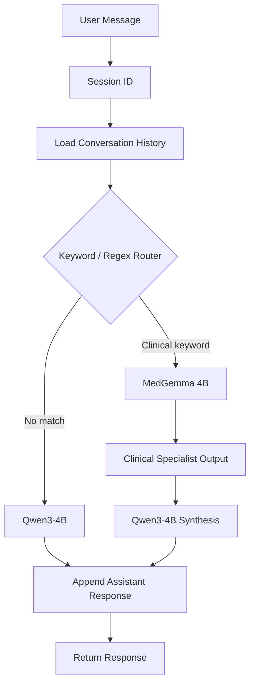

# MedGemma Agent — Milestone 3

Two-model architecture with dumb keyword routing. A FastAPI chat backend backed
by Qwen3-4B (orchestrator) and MedGemma 4B (clinical specialist), both served
via Ollama, with sessions keyed by a `session_id`.

```
User → FastAPI POST /chat → Router → Qwen3-4B and/or MedGemma 4B → Response
```

## Conversation flow



When MedGemma is invoked, its output is passed to Qwen as context:

```text
A clinical specialist model produced the following note:

[MedGemma output]

Respond to the user using this information in clear, plain language.
```

## Prerequisites

- Ollama installed and running with both models pulled:

  ```sh
  ollama pull qwen3:4b
  ollama pull medgemma:4b
  ```

## Setup

```sh
python3 -m venv .venv
.venv/bin/pip install -r requirements.txt
```

## Run

```sh
.venv/bin/uvicorn app.main:app --host 0.0.0.0 --port 8000
```

To use Redis as the session store:

```sh
SESSION_STORE=redis .venv/bin/uvicorn app.main:app --host 0.0.0.0 --port 8000
```

## Use

Start a conversation (a `session_id` is generated and returned):

```sh
curl -X POST http://localhost:8000/chat \
  -H "Content-Type: application/json" \
  -d '{"message": "I have a mild headache. Should I worry?"}'
```

Response:

```json
{"session_id": "3f2a...", "response": "..."}
```

Continue the same conversation by passing the `session_id` back:

```sh
curl -X POST http://localhost:8000/chat \
  -H "Content-Type: application/json" \
  -d '{"message": "It is mostly on the left side.", "session_id": "3f2a..."}'
```

## Routing

A naive keyword router decides whether a turn is clinical. It triggers on any of
these words appearing in the message:

```
pain, hurts, symptom, fever, headache, bleeding, swelling, nausea, cough
```

- **Match** → MedGemma produces a clinical note, which is injected as a system
  message into Qwen's context; Qwen synthesizes the final plain-language
  response.
- **No match** → Qwen answers directly.

This router will misfire, miss some clinical questions, and trigger
unnecessarily on some words. That is expected at this stage — the goal is to
validate the two-model call pattern end-to-end. Context-aware routing replaces
it in a later milestone.

## Endpoints

| Method | Path | Description |
|---|---|---|
| `POST` | `/chat` | Send a message in a session. Creates a session if `session_id` is omitted. |
| `DELETE` | `/sessions/{session_id}` | Reset a session (clears its history). |
| `GET` | `/health` | Liveness check. |

### `POST /chat`

Request:

```json
{
  "message": "string (required, non-empty)",
  "session_id": "string (optional)",
  "temperature": 0.7
}
```

Response `200`:

```json
{
  "session_id": "string",
  "response": "string"
}
```

Errors:

| Status | When |
|---|---|
| `422` | `message` is missing/empty, `temperature` out of range, or `session_id` is an empty string. |
| `410` | A `session_id` was supplied but the session is unknown or expired. |
| `502` | A model server returned an HTTP error. |
| `503` | A model server is unreachable. |

### `DELETE /sessions/{session_id}`

| Status | When |
|---|---|
| `204` | Session was reset (history cleared). |
| `404` | No session with that id exists. |

## Session lifecycle

- **Creation** — omitting `session_id` starts a fresh session and returns its
  id; the client keeps it for later turns.
- **Continuation** — passing an existing `session_id` loads its history, which
  is sent to the model alongside the new message.
- **Expiry** — sessions idle out after `SESSION_TIMEOUT_SECONDS`. The timeout is
  *sliding*: every saved turn refreshes it. An expired or unknown
  `session_id` is rejected with `410 Gone`; the client should start a new
  session.
- **Reset** — `DELETE /sessions/{session_id}` removes the session's history.
  A subsequent `POST` with the same id returns `410`.

## Context management

Two independent caps prevent unbounded context growth:

| Cap | Env var | Default | Scope |
|---|---|---|---|
| Stored history | `MAX_HISTORY_MESSAGES` | `40` | Max messages kept per session. Oldest are dropped when exceeded. |
| Model context | `MAX_CONTEXT_MESSAGES` | `20` | Max messages sent to the model each turn. |
| Char budget | `MAX_CONTEXT_CHARS` | `16000` | Max characters sent to the model each turn. |

When the context window exceeds the message cap, the oldest messages are
dropped. Trimming always keeps user/assistant pairs intact (the window starts on
a user turn unless only one message can be kept). The character budget drops
from the front as a second guard against very long turns. At least one message
(the current turn) is always retained.

## Storage backends

| `SESSION_STORE` | Implementation | Use |
|---|---|---|
| `memory` (default) | `InMemorySessionStore` — a process-local dict with lazy expiry | Local development, tests |
| `redis` | `RedisSessionStore` — keys `medgemma:session:{id}`, sliding TTL via `EX` | Production |

With Redis, sessions persist across process restarts and across multiple app
instances, and expire via server-side TTL. A fresh Redis client is created per
operation, so no event-loop or connection lifecycle management is needed.

## Configuration

Environment variables (see `.env.example`):

| Variable | Default | Description |
|---|---|---|
| `MODEL_NAME` | `qwen3:4b` | Orchestrator/synthesis model (Qwen). |
| `SPECIALIST_MODEL_NAME` | `medgemma:4b` | Clinical specialist model (MedGemma). |
| `OLLAMA_BASE_URL` | `http://localhost:11434` | Ollama server. Uses its OpenAI-compatible `/v1` API. |
| `LLM_TIMEOUT_SECONDS` | `120` | Timeout for model calls. |
| `SESSION_STORE` | `memory` | `memory` or `redis`. |
| `REDIS_URL` | `redis://localhost:6379/0` | Redis connection when `SESSION_STORE=redis`. |
| `SESSION_TIMEOUT_SECONDS` | `1800` | Idle timeout per session (sliding). |
| `MAX_HISTORY_MESSAGES` | `40` | Max messages stored per session. |
| `MAX_CONTEXT_MESSAGES` | `20` | Max messages sent to the model (context trimming). |
| `MAX_CONTEXT_CHARS` | `16000` | Char budget for the model context window. |

## System boundary

The system prompt pins the assistant's role:

> I'm not a diagnostic tool; for anything urgent, contact emergency services.

## Test

```sh
.venv/bin/python -m pytest tests/ -q
```

Tests are offline-safe: model calls are mocked. The Redis store test runs
automatically when a Redis server is reachable at `REDIS_URL` and is skipped
otherwise.

## Scope

This milestone intentionally has no real triage, emergency override, or
prescription reading. Routing is a naive keyword match (no context awareness)
and is expected to misfire. Multi-user concurrency is limited to one user at a
time. Context summarization is deferred to a later milestone.