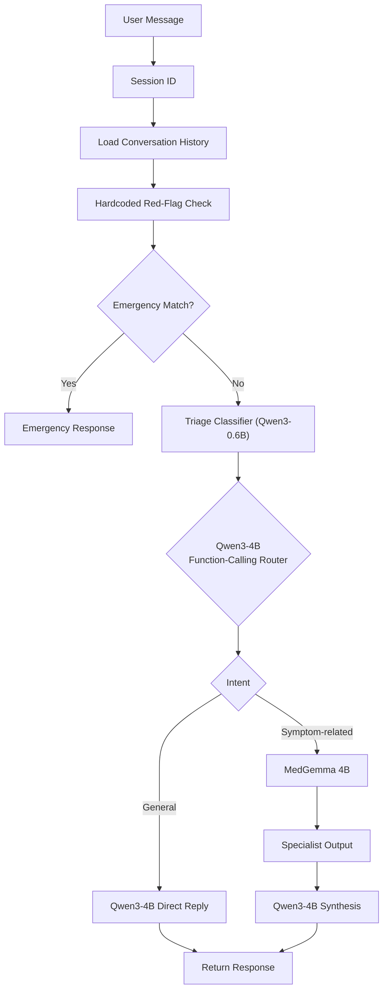

# MedGemma Agent — Milestone 6.1

Contextual routing via function calling, with PostgreSQL persistence and an
append-only audit trail. A FastAPI chat backend backed by
three models served via Ollama:

- **Qwen3-4B** — orchestrator / router / plain-language synthesis
- **MedGemma 4B** — clinical specialist (free-form note)
- **Qwen3-0.6B** — tiny triage classifier (urgency, schema-constrained)

Plus a deterministic, non-model red-flag safety floor that runs on every turn.

```
User → Safety check → Triage (Qwen3-0.6B) → Qwen function-calling router → MedGemma 4B → Qwen3-4B synthesis → Response
```

## Conversation flow



## Safety floor

A deterministic, non-model red-flag check runs **on every user turn** before any
model is called. If it matches, the pipeline short-circuits and returns a fixed
emergency response. The emergency decision never depends on Qwen, MedGemma,
the triage model, routing, or confidence.

Current red-flag categories:

```
chest pain, breathing difficulty, stroke signs, suicidal ideation,
severe bleeding, anaphylaxis signs, seizure, unconsciousness
```

This is a reviewed-clinical-artifact placeholder and should be refined with
clinical input.

## Triage

The tiny triage classifier (`TRIAGE_MODEL_NAME`, default `qwen3:0.6b`)
classifies every non-emergency turn via Ollama's native `/api/chat` endpoint
with a JSON-schema `format` constraint:

```json
{"urgency": "emergency" | "medical" | "general"}
```

The result is injected into Qwen's context so the final reply is calibrated to
the urgency level. Triage is a soft signal for Qwen — the hardcoded red-flag
check remains the only short-circuit.

Urgency is a typed enum (`Urgency` in `app/triage/parsing.py`), and every
`/chat` response carries it as a typed `urgency` field (`emergency`, `medical`,
or `general`; `null` when triage is disabled). The JSON-schema constraint sent
to the triage model is derived from the same enum, so the schema and the
response type can never drift apart.

## Routing

Routing is **contextual**: Qwen decides whether a turn needs the clinical
specialist, using the full conversation rather than keywords. Qwen is given a
`call_medical_specialist(reason: str)` function via Ollama's OpenAI-compatible
tool-calling API:

- **Tool called** → MedGemma produces a clinical note from the reason, injected
  as a system message into Qwen's synthesis context.
- **No tool call** → Qwen replies directly (single model call — faster general
  conversation).

Routing categories are `general`, `symptom_related`, and `emergency`. The
function-calling router can only produce `general` or `symptom_related`; the
`emergency` category is owned exclusively by the independent hardcoded safety
check, which runs first and short-circuits before any model call. The classifier
can never route around the emergency layer.

### Reply sanitization

Qwen3 sometimes prefixes its reply with a reasoning preamble and wraps the real
answer in `<response>...</response>` tags. `extract_answer` strips that and
returns the clean reply. Model calls are made with `enable_thinking: false`, so
the `<response>` wrapper is consistent and the reply is recoverable.

## Project layout

```
app/
  main.py            # thin FastAPI endpoints + error mapping + alembic on startup
  core/              # infrastructure
    config.py        #   environment-driven settings
    db.py            #   async engine + session factory (SQLModel)
    models.py        #   SQLModel tables: sessions / messages / audit_events
    context.py       #   trim_context() context-window logic
  api/               # HTTP contract
    schemas.py       #   ChatRequest / ChatResponse / AuditEvent
  audit/             # append-only audit logger (Postgres / null)
  llm/               # LLM client + reply extraction
    client.py        #   LLMClient (OpenAI-compat + native triage API)
    parsing.py       #   extract_answer()
  safety/            # deterministic red-flag floor (non-model)
  triage/            # urgency enum + parsing / validation
  prompts/           # prompts by domain
    base.py          #   system prompt
    routing.py       #   routing prompt + specialist tool schema
    specialist.py    #   MedGemma specialist prompt + context
    triage.py        #   triage prompt + JSON schema + context
  routes/            # routing decisions
    function_calling.py  #   tool-call parsing + routing categories
  sessions/          # session memory
    models.py        #   Session model + expiry error
    stores.py        #   InMemory / Redis stores
    postgres.py      #   PostgreSQL store (append-only messages)
    manager.py       #   SessionManager + singleton
  services/
    chat.py          # run_chat_turn() orchestration (one full turn)
alembic/              # migration scripts (autogenerated from app/core/models.py)
tests/               # offline-safe (model calls mocked; DB tests skip when no server)
```

## Prerequisites

- Ollama installed and running with all three models pulled:

  ```sh
  ollama pull qwen3:4b
  ollama pull medgemma:4b
  ollama pull qwen3:0.6b
  ```

## Setup

```sh
python3 -m venv .venv
.venv/bin/pip install -r requirements.txt
```

## Run

```sh
.venv/bin/uvicorn app.main:app --host 0.0.0.0 --port 8000
```

To use Redis as the session store:

```sh
SESSION_STORE=redis .venv/bin/uvicorn app.main:app --host 0.0.0.0 --port 8000
```

## Use

Start a conversation (a `session_id` is generated and returned):

```sh
curl -X POST http://localhost:8000/chat \
  -H "Content-Type: application/json" \
  -d '{"message": "I have a mild headache. Should I worry?"}'
```

Response:

```json
{"session_id": "3f2a...", "response": "..."}
```

Continue the same conversation by passing the `session_id` back:

```sh
curl -X POST http://localhost:8000/chat \
  -H "Content-Type: application/json" \
  -d '{"message": "It is mostly on the left side.", "session_id": "3f2a..."}'
```

## Endpoints

| Method | Path | Description |
|---|---|---|
| `POST` | `/chat` | Send a message in a session. Creates a session if `session_id` is omitted. |
| `DELETE` | `/sessions/{session_id}` | Reset a session (clears its history). |
| `GET` | `/health` | Liveness check. |

### `POST /chat`

Request:

```json
{
  "message": "string (required, non-empty)",
  "session_id": "string (optional)",
  "temperature": 0.7
}
```

Response `200`:

```json
{
  "session_id": "string",
  "response": "string"
}
```

Errors:

| Status | When |
|---|---|
| `422` | `message` is missing/empty, `temperature` out of range, or `session_id` is an empty string. |
| `410` | A `session_id` was supplied but the session is unknown or expired. |
| `502` | A model server returned an HTTP error. |
| `503` | A model server is unreachable. |

### `DELETE /sessions/{session_id}`

| Status | When |
|---|---|
| `204` | Session was reset (history cleared). |
| `404` | No session with that id exists. |

## Session lifecycle

- **Creation** — omitting `session_id` starts a fresh session and returns its
  id; the client keeps it for later turns.
- **Continuation** — passing an existing `session_id` loads its history, which
  is sent to the model alongside the new message.
- **Expiry** — sessions idle out after `SESSION_TIMEOUT_SECONDS`. The timeout is
  *sliding*: every saved turn refreshes it. An expired or unknown
  `session_id` is rejected with `410 Gone`; the client should start a new
  session.
- **Reset** — `DELETE /sessions/{session_id}` removes the session's history.
  A subsequent `POST` with the same id returns `410`.

## Context management

Two independent caps prevent unbounded context growth:

| Cap | Env var | Default | Scope |
|---|---|---|---|
| Stored history | `MAX_HISTORY_MESSAGES` | `40` | Max messages kept per session. Oldest are dropped when exceeded. |
| Model context | `MAX_CONTEXT_MESSAGES` | `20` | Max messages sent to the model each turn. |
| Char budget | `MAX_CONTEXT_CHARS` | `16000` | Max characters sent to the model each turn. |

When the context window exceeds the message cap, the oldest messages are
dropped. Trimming always keeps user/assistant pairs intact (the window starts on
a user turn unless only one message can be kept). The character budget drops
from the front as a second guard against very long turns. At least one message
(the current turn) is always retained.

## Storage backends

| `SESSION_STORE` | Implementation | Use |
|---|---|---|
| `memory` (default) | `InMemorySessionStore` — a process-local dict with lazy expiry | Local development, tests |
| `redis` | `RedisSessionStore` — keys `medgemma:session:{id}`, sliding TTL via `EX` | Stateless horizontal scale |
| `postgres` | `PostgresSessionStore` — relational sessions + append-only messages | Production (audit + evaluation) |

With Redis, sessions persist across process restarts and across multiple app
instances, and expire via server-side TTL. A fresh Redis client is created per
operation, so no event-loop or connection lifecycle management is needed.

With PostgreSQL, sessions and messages live in relational tables and full
conversation history is retained (no trimming). Messages are append-only — once
written they are never updated.

### Migrations

The schema is owned by **SQLModel** models in `app/core/models.py` and managed
with **Alembic**. There is no hand-written DDL: schema changes are made to the
models, then autogenerated:

```sh
alembic revision --autogenerate -m "describe change"
alembic upgrade head
```

The app runs `alembic upgrade head` automatically at startup (when Postgres
storage or audit is enabled). Tests create tables directly from
`SQLModel.metadata.create_all` and never run Alembic.

### Audit logging (PostgreSQL)

When `SESSION_STORE=postgres` (or `AUDIT_ENABLED=true`), every turn appends
immutable rows to the `audit_events` table. Events are tied to the session and
turn and carry a module identifier:

| Module | Event | Captured |
|---|---|---|
| `safety` | `safety_override` | Hardcoded red-flag escalation that bypassed the models |
| `triage` | `triage_result` | Urgency classification + raw triage output |
| `router` | `routing_decision` | Category, reason, raw routing content + tool calls |
| `specialist` | `specialist_output` | MedGemma note retained in full (reason, note, model) |
| `chat` | `turn_completed` | Final response + temperature + model |

The audit trail is append-only by construction: the logger issues only
`INSERT` statements and exposes no update or delete path, so records cannot be
retroactively modified.

## Configuration

Environment variables (see `.env.example`):

| Variable | Default | Description |
|---|---|---|
| `MODEL_NAME` | `qwen3:4b` | Orchestrator/synthesis model (Qwen). |
| `SPECIALIST_MODEL_NAME` | `medgemma:4b` | Clinical specialist model (MedGemma). |
| `TRIAGE_MODEL_NAME` | `qwen3:0.6b` | Tiny triage classifier model. |
| `TRIAGE_ENABLED` | `true` | Toggle the triage classifier + hardcoded escalation. |
| `OLLAMA_BASE_URL` | `http://localhost:11434` | Ollama server. |
| `LLM_TIMEOUT_SECONDS` | `120` | Timeout for model calls. |
| `SESSION_STORE` | `memory` | `memory`, `redis`, or `postgres`. |
| `DATABASE_URL` | `postgresql:///medgemma-agent` | PostgreSQL connection when `SESSION_STORE=postgres` (or audit enabled). Schema via Alembic. |
| `AUDIT_ENABLED` | `true` if `SESSION_STORE=postgres` | Toggle the append-only audit log. |
| `REDIS_URL` | `redis://localhost:6379/0` | Redis connection when `SESSION_STORE=redis`. |
| `SESSION_TIMEOUT_SECONDS` | `1800` | Idle timeout per session (sliding). |
| `MAX_HISTORY_MESSAGES` | `40` | Max messages stored per session. |
| `MAX_CONTEXT_MESSAGES` | `20` | Max messages sent to the model (context trimming). |
| `MAX_CONTEXT_CHARS` | `16000` | Char budget for the model context window. |

## System boundary

The system prompt pins the assistant's role:

> I'm not a diagnostic tool; for anything urgent, contact emergency services.

## Test

```sh
.venv/bin/python -m pytest tests/ -q
```

Tests are offline-safe: model calls are mocked. The Redis store test runs
automatically when a Redis server is reachable at `REDIS_URL` and is skipped
otherwise. The PostgreSQL store and audit tests run automatically when a
PostgreSQL server is reachable at `DATABASE_URL` and are skipped otherwise.

## Scope

This milestone intentionally has no prescription reading. The
red-flag list is a placeholder pending clinical review. Multi-user concurrency
is limited to one user at a time. Routing is contextual (function calling), but
the specialist decision is a single tool call — multi-hop tool chains and
persistent tool context are not yet supported.