# Architecture Incremental Build Guide

## Medical Triage + Conversation Agent
### MedGemma 4B / 1.5 4B + Qwen3-4B

> **This is a build order, not a layered architecture diagram.**
>
> Every milestone below produces a **complete, runnable system**. You should be able to interact with it end-to-end after every step. Nothing is left half-wired for a later milestone to complete.
>
> Complexity is added on top of something that already works, rather than building several incomplete layers simultaneously.

---

# 1. Target End State

The target is a **single-GPU-deployable medical triage + general health conversation agent** with:

- Qwen3-4B as the orchestrator
- MedGemma 4B / MedGemma 1.5 4B as the clinical specialist
- Hardcoded emergency escalation
- Full audit logging
- Multi-turn conversation
- Text and image input
- Task-specific medical modules
- Structured specialist outputs
- Plain-language synthesis
- Module-specific evaluation
- Production guardrails and observability

## Core Architecture Pattern

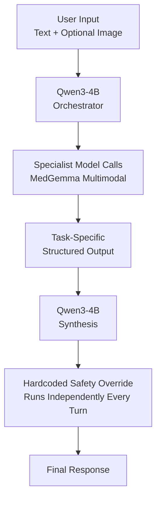

The architecture is intentionally split into four responsibilities:

1. **Qwen orchestrates**
2. **MedGemma specializes**
3. **Qwen translates specialist output into plain language**
4. **Deterministic safety code provides the safety floor**

---

# 2. Task-Specific Modules

Each module has its own:

- Trigger/routing logic
- Prompt
- Output schema
- Safety rules
- Evaluation set
- Audit-log representation

| Module | Purpose | Specialist |
|---|---|---|
| **Symptom Triage** | Urgency assessment + red flags + next action | MedGemma |
| **Prescription Reading** | Medication/dosage/frequency extraction | MedGemma 1.5 |
| **Lab Report Reading** | Parse values and flag abnormal results | MedGemma 1.5 |
| **Medication Interaction Check** | Compare medications for conflicts | MedGemma 1.5 |

Future modules follow the same infrastructure pattern without requiring changes to the core runtime.

---

# 3. Routing & Versioning Strategy

One gateway, one frontend, independently-versioned backend tracks behind it. The user never sees the seam; tracks move at different speeds and clear different review gates internally.

```
api.yourapp.com
├── /v1/...            → conversation, triage, prescription reading, and future modules
│                          (lab reports, medication interactions, discharge summaries)
│                          fast iteration, per-module eval gate, MedGemma 4B/1.5 4B tier
└── /imaging/v1/...     → x-ray / CT interpretation
                           separate service, separate deploy cadence, MedGemma 27B tier,
                           own regulatory review checkpoint before development starts
```

## Why Split Imaging Out

Imaging sits in a meaningfully higher risk tier than the `/v1` modules — closer to diagnostic-device territory — and needs a larger model (27B, not 4B) to be worth shipping at all. Keeping it on its own path prefix means it can be held for review, re-training, or regulatory hold without taking triage/prescription/labs down with it.

## Shared, Not Duplicated

Auth, audit logging, and the guardrail engine are infrastructure — build once (Milestone 8), mount under both path prefixes. Do not fork these per-track; forking the audit trail is how the system ends up with two incompatible logs.

## Frontend Implication

If imaging results need a mandatory human-clinician-review step before reaching the patient, that gate should live in the shared gateway/frontend layer — not duplicated inside the imaging service — so it cannot be bypassed by calling `/imaging/v1/...` directly.

## Hardening Is Per-Module, Not a One-Time Milestone

Every module (triage, prescription, labs, interactions, imaging) needs its own eval set and its own red-team pass before pilot. Milestone 8 stands up the *infrastructure* for this (guardrail engine, observability, quantization), but each module still runs its own eval and red-team pass against that shared infrastructure rather than inheriting a single end-of-project hardening step.

---

# Milestone 1 — Talking Qwen, Nothing Else

**API:** `/v1/chat`

## Goal

Build a working chat endpoint with Qwen and nothing else.

## Build

- [ ] Stand up Qwen3-4B behind:
  - vLLM, or
  - Ollama for the fastest initial implementation
- [ ] Expose an OpenAI-compatible endpoint.
- [ ] Create a FastAPI backend.
- [ ] Add a single endpoint:

```http
POST /chat
```

- [ ] Forward the user's message to Qwen.
- [ ] Return Qwen's response.
- [ ] Keep the system stateless.
- [ ] Do not add session state yet.

## Request Flow

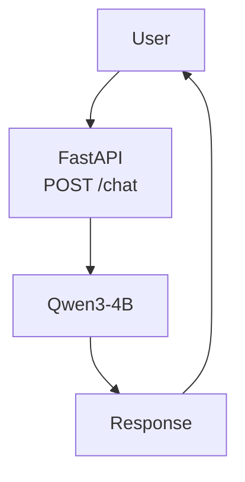

## System Boundary

The system prompt establishes a clear boundary:

> I'm not a diagnostic tool; for anything urgent, contact emergency services.

The exact wording can evolve later as the safety system becomes more sophisticated.

## Viable System

At the end of this milestone:

```text
User → FastAPI → Qwen → Response
```

It is a working general-purpose health-chat bot.

It intentionally has:

- No MedGemma
- No routing
- No session state
- No triage logic
- No prescription reading

This is expected.

The purpose of the milestone is to validate:

- Model serving
- API communication
- Request/response handling
- Basic health-chat behavior

**Estimated effort:** 1–2 days

---

# Milestone 2 — Multi-Turn Conversation

**API:** `/v1/chat`

## Goal

Give the assistant session-level conversational memory.

## Build

Add session state using:

- [ ] Redis for the eventual production architecture, or

Sessions are keyed by a `session_id`.

## Conversation Flow

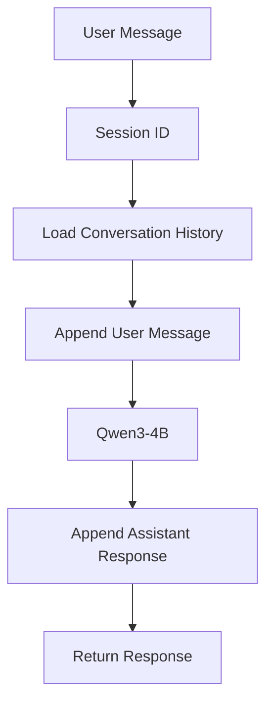

## Required Controls

Implement:

- Session timeout
- Session reset
- Maximum history size
- Context trimming
- Protection against unbounded context growth

A summarization strategy can be introduced later if necessary.

## Example

```text
User: I've had a headache since yesterday.
Assistant: ...

User: It's mostly on the left side.
Assistant: ...

User: And now I'm feeling nauseous.
Assistant: ...
```

Qwen can now see the relevant conversation history.

## Still Missing

- MedGemma
- Medical specialist routing
- Real triage
- Emergency override
- Prescription reading

**Estimated effort:** 1 day

---

# Milestone 3 — Bring in MedGemma with Dumb Routing

**API:** `/v1/chat` (internal MedGemma call, not yet its own endpoint)

## Goal

Validate the two-model architecture before building sophisticated routing.

## Build

Stand up MedGemma 4B as a second model endpoint.

Implement a simple keyword/regex router.

Example triggers:

```text
pain
hurts
symptom
fever
headache
bleeding
swelling
nausea
cough
```

## Routing Flow

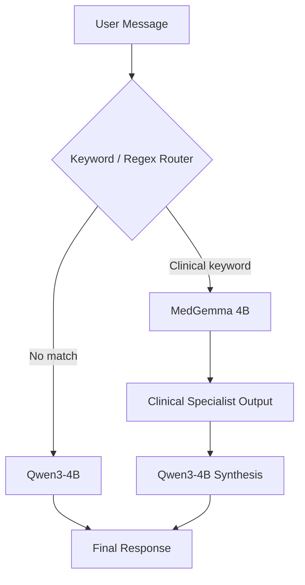

## Specialist Context

When MedGemma is invoked, its output is passed to Qwen as context.

Conceptually:

```text
A clinical specialist model produced the following note:

[MedGemma output]

Respond to the user using this information in clear, plain language.
```

## Viable System

Clinical questions now exercise:

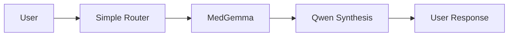

The router will:

- Misfire
- Miss some clinical questions
- Trigger unnecessarily on some words

That is acceptable at this stage.

The goal is to prove that the specialist-model call pattern works end-to-end.

**Estimated effort:** 2–3 days

---

# Milestone 4 — Real Triage Output + Hardcoded Escalation

**API:** `/v1/triage`

## Goal

Turn the specialist model into an actual triage component while establishing a deterministic safety floor.

This is the most important architectural milestone.

---

## 4.1 Structured MedGemma Output

Change MedGemma from free-form output to structured output.

Example:

```json
{
  "urgency": "emergency | urgent | routine | self_care",
  "red_flags": [],
  "reasoning": ""
}
```

Use:

- Strict prompting
- JSON mode
- Grammar constraints
- Schema-constrained generation

where supported by the serving stack.

---

## 4.2 Hardcoded Red-Flag System

Build the red-flag system as a **separate, non-model component**.

It must run on every user turn regardless of what Qwen or MedGemma decides.

Potential categories include:

- Chest pain
- Breathing difficulty
- Stroke signs
  - Facial drooping
  - Slurred speech
  - Sudden weakness
- Suicidal ideation
- Severe bleeding
- Anaphylaxis signs
- Other clinically reviewed emergency indicators

## Safety Flow

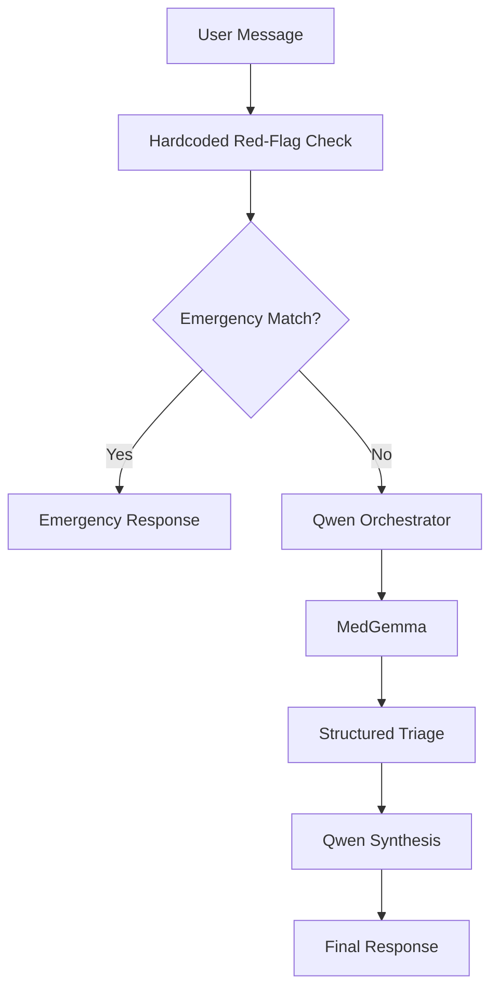

If the deterministic safety layer detects an emergency, it can short-circuit the model pipeline.

### Critical Principle

The emergency decision must not depend on:

- Qwen
- MedGemma
- Qwen's confidence
- Qwen's routing decision
- Qwen's final wording

---

## 4.3 Qwen Final Synthesis

The final response should communicate:

1. Urgency level
2. Relevant reason
3. One clear next action

## Viable System

At the end of this milestone, the system has:

> **An actual triage tool rather than merely a chatbot with a medical model attached.**

The deterministic emergency path is the safety floor.

**Estimated effort:** 3–4 days

> The red-flag list should be treated as a reviewed clinical artifact and ideally developed with appropriate clinical input.

---

# Milestone 5 — Replace Keyword Routing with Function-Calling

**API:** `/v1/chat`, `/v1/triage`

## Goal

Replace the keyword router with contextual routing.

## Build

Give Qwen a specialist function such as:

```text
call_medical_specialist(reason: str)
```

Qwen decides whether MedGemma is necessary based on the actual conversation.

## Routing Categories

At minimum:

```text
emergency
medical
general
```

## Architecture

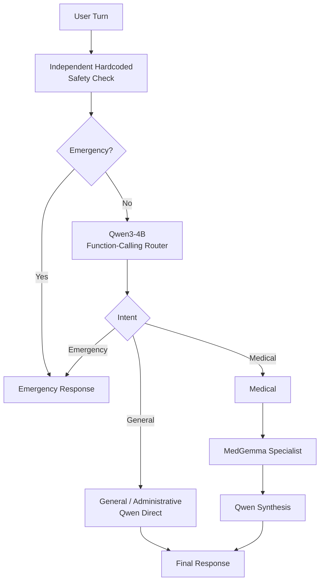

## Critical Constraint

The Milestone 4 hardcoded safety check remains independent.

The classifier must never be able to route around the emergency layer.

## Benefits

- Fewer missed clinical turns
- Fewer unnecessary MedGemma calls
- Faster general conversation
- Better contextual routing
- Clear separation between orchestration and specialist reasoning

**Estimated effort:** 2–3 days

---

# Milestone 6 — Persistent Logging + Minimal Web UI

**API:** `/v1/chat`, `/v1/triage` (shared gateway/auth/logging layer established here)

## Goal

Make the system usable by someone other than you at a terminal and make its behavior auditable.

---

## 6.1 PostgreSQL

Replace temporary session storage with PostgreSQL.

Store:

- Sessions
- Messages
- Specialist outputs
- Routing decisions
- Safety overrides
- Triage results
- Module identifiers
- Relevant execution metadata

Specialist outputs should be retained in full where appropriate for audit/evaluation purposes.

The application should treat audit records as append-only.

---

## 6.2 Frontend

Build a minimal React/Next.js interface.

Requirements:

- Chat interface
- Image upload support where applicable
- Streaming responses
- SSE
- Session handling
- Urgency visualization

## End-to-End Architecture

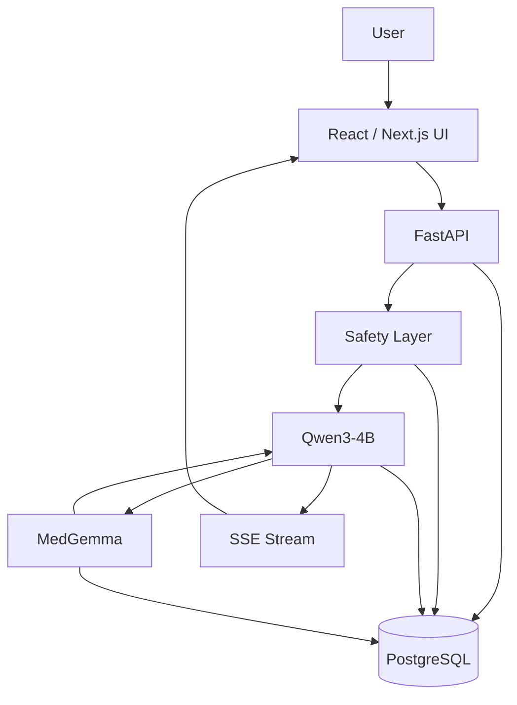

## 6.3 Urgency UI

Triage results should be visually scannable.

Example:

```text
URGENCY: URGENT
```

rather than burying the urgency level inside a paragraph.

## Viable System

At the end of this milestone:

> A user can interact with the system through a browser and every important triage/model decision has an audit trail.

This is the first point where structured feedback from testers becomes practical.

**Estimated effort:** 4–5 days

---

# Milestone 7 — Image Input for Visual Symptoms

**API:** `/v1/triage` (extended, still `/v1`, still MedGemma 4B tier)

## Goal

Extend triage to symptoms that are easier to show than describe.

Examples:

- Rashes
- Wounds
- Swelling
- Visible skin changes
- Other externally observable symptoms

## Model

Use:

**MedGemma 1.5 4B multimodal**

## Input Flow

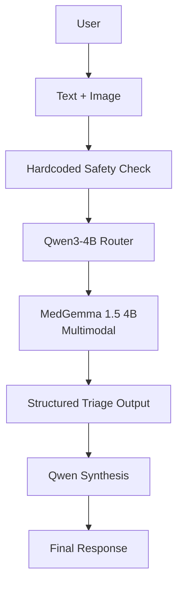

## Routing Rule

An attached image must not simply be discarded because the text classifier did not detect a symptom keyword.

Image input should be routed to the multimodal specialist when clinically relevant.

## Extended Triage Schema

```json
{
  "urgency": "emergency | urgent | routine | self_care",
  "red_flags": [],
  "text_findings": [],
  "image_findings": [],
  "reasoning": ""
}
```

The system should distinguish between:

- Findings derived from user text
- Findings derived from the image
- Uncertainty

## Viable System

The triage system now supports both:

- Text-described symptoms
- Visually described symptoms

This is a genuine capability expansion rather than merely another infrastructure layer.

**Estimated effort:** 3–4 days

---

# Milestone 8 — Guardrails, Evaluation & Hardening

**API:** shared gateway layer, sits under `/v1/*`

## Goal

Move from "works in testing" toward a supervised-pilot-ready triage system.

---

## 8.1 Output Guardrails

Add a guardrail pass to every outgoing response.

Check for:

- Definitive diagnostic claims
- Missing required disclaimers
- Emergency-path bypasses
- Contradictions with structured triage
- Unsafe wording

Start with deterministic rules.

A smaller classifier can be introduced later if false-positive/false-negative rates justify it.

## Guardrail Flow

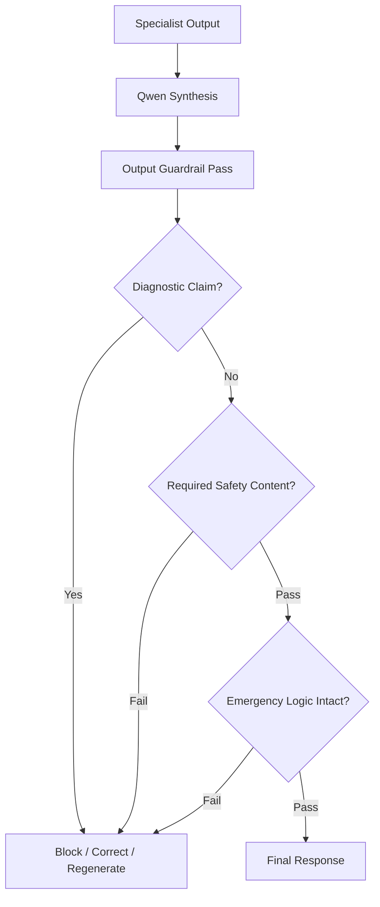

---

## 8.2 Triage Evaluation Set

Build an evaluation set specifically weighted toward:

> **Under-escalation failures**

Include:

- Clear emergencies
- Borderline cases
- Clearly benign cases
- Adversarial cases
- Cases where the user tries to convince the system not to escalate

Expected urgency labels should be defined before running the system.

---

## 8.3 Observability

Use Langfuse or a similar tracing platform.

Track:

- Qwen calls
- MedGemma calls
- Latency
- Token usage
- Routing decision
- Specialist output
- Safety override
- Final response
- Module selected

Example path identifiers:

```text
emergency_override
medical_specialist
qwen_direct
```

## Observability Flow

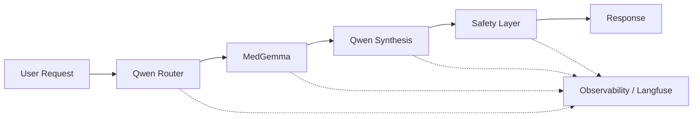

---

## 8.4 Model Quantization

Quantize both models using an appropriate 4-bit format such as:

- AWQ
- GPTQ

Validate:

- GPU memory usage
- Latency
- Quality
- Concurrent behavior
- End-to-end stability

Confirm that the complete architecture fits within the target single-GPU deployment budget.

---

## 8.5 Red-Team Testing

Test attempts to:

- Talk the system out of escalating
- Hide emergency symptoms
- Obtain definitive diagnoses
- Override safety instructions
- Manipulate structured outputs
- Cause routing failures
- Trigger prompt-injection-style behavior
- Make Qwen ignore specialist results
- Make specialist uncertainty disappear during synthesis

## Viable System

At the end of Milestone 8:

> The system has the evaluation, observability, guardrails, deterministic safety checks, and adversarial testing required to consider a supervised pilot.

Legal/regulatory review should be performed against this milestone rather than an earlier prototype.

**Estimated effort:** 1–2 weeks

---

# Milestone 9 — Prescription Reading

**API:** `/v1/prescription`

## Goal

Add prescription reading as a standalone feature module.

Users can upload:

- Paper prescriptions
- Pill-bottle labels
- Medication cards

and receive:

- Structured medication information
- Plain-language explanation
- Extraction confidence
- Unclear-field warnings
- Prescription-specific safety warnings

---

# 9.1 Prescription-Specific Routing

## Goal

Extend Qwen function-calling to recognize prescription-related intent.

### Trigger Phrases

Examples:

```text
read this prescription
what medication is this
tell me about this prescription
my doctor prescribed this
I don't understand this prescription
```

### Image-Based Trigger

An uploaded image without symptom-related language can be considered a prescription-reading candidate.

If both text and image are present, Qwen decides which specialist capability is required.

## Routing Examples

### Symptom + Image

```text
"What is this rash?"
+
Rash image
```

→ **Triage**

### Medication + Image

```text
"What is this medication?"
+
Pill bottle photo
```

→ **Prescription Reader**

### Emergency + Prescription

```text
"I have chest pain."
+
Prescription photo
```

→ **Emergency safety path first**

Prescription reading may then be performed as a secondary operation if appropriate.

## Routing Flow

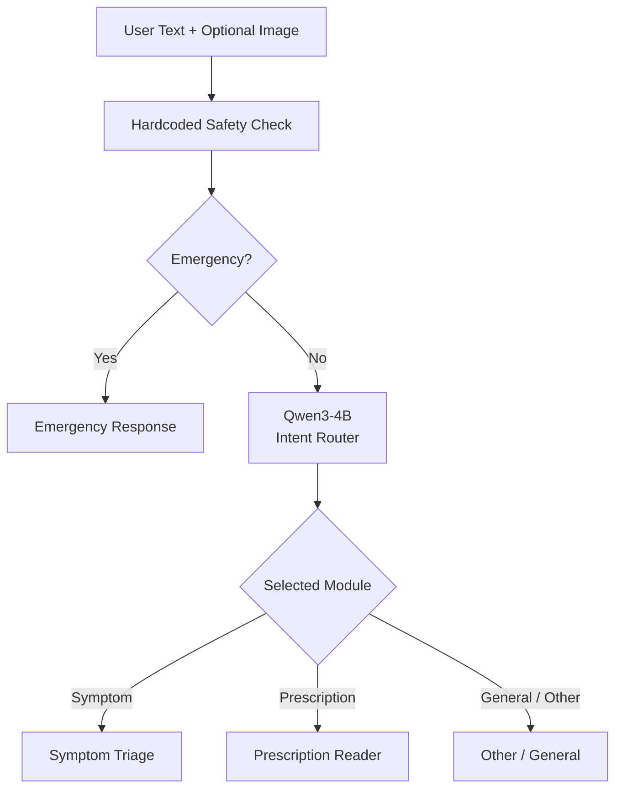

**Estimated effort:** 1 day

---

# 9.2 MedGemma Prescription Extraction

## Goal

Use MedGemma 1.5 4B multimodal with a prescription-specific prompt and structured schema.

### Output Schema

```json
{
  "medication_name": "string",
  "dosage": "string",
  "dosage_form": "string",
  "frequency": "string",
  "duration": "string",
  "prescriber_name": "string | null",
  "pharmacy_info": "string | null",
  "dispensing_date": "string | null",
  "quantity": "string | null",
  "special_instructions": [],
  "warnings": [],
  "confidence": "high | medium | low",
  "unclear_fields": [],
  "raw_ocr_text": "string | null"
}
```

### Extraction Requirements

The model should distinguish between:

- Clearly visible information
- Ambiguous information
- Missing information
- Model inference

The system should never turn an unreadable prescription into a confidently fabricated field.

### Example Structured Result

```json
{
  "medication_name": "Example Drug",
  "dosage": "500 mg",
  "dosage_form": "tablet",
  "frequency": "twice daily",
  "duration": "7 days",
  "prescriber_name": null,
  "pharmacy_info": null,
  "dispensing_date": null,
  "quantity": "14",
  "special_instructions": [
    "Take with food"
  ],
  "warnings": [],
  "confidence": "medium",
  "unclear_fields": [
    "prescriber_name"
  ],
  "raw_ocr_text": null
}
```

**Estimated effort:** 2 days

---

# 9.3 Prescription Safety Checks

## Goal

Create a deterministic prescription safety layer independent of model judgment.

Potential categories include:

### High-Risk Medications

- Opioids
- Anticoagulants
- Insulin
- Chemotherapy agents
- Certain psychiatric medications

### Known Dangerous Combinations

Examples:

- Warfarin + NSAIDs
- ACE inhibitors + potassium-sparing diuretics

### Other Checks

- Missing medication name
- Missing dosage
- Missing frequency
- Potential dosage above a reviewed maximum
- Obvious parsing failure
- Relevant pregnancy/breastfeeding warnings where applicable information has been provided

## Safety Flow

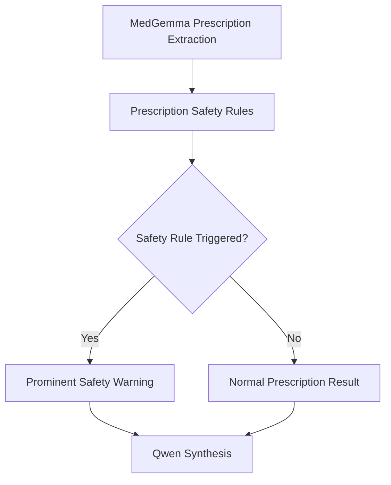

If a safety rule triggers, the warning should be prominently represented in the UI rather than buried in prose.

> High-risk medication lists, interaction rules, and dosage limits should be based on clinically reviewed and maintained references rather than an ad-hoc static list.

**Estimated effort:** 2 days

---

# 9.4 Qwen Prescription Synthesis

## Goal

Translate the structured extraction into patient-friendly language.

Qwen receives:

```text
Structured prescription extraction
+
Safety-check results
+
Relevant conversation context
```

It should explain:

1. What the medication is generally used for
2. How and when the medication is intended to be taken according to the extracted prescription
3. Common side effects and warnings
4. What to do if the prescription is unclear
5. When to ask a pharmacist or prescriber

The response should remain factual and should not infer an unsupported diagnosis.

## Required Safety Message

> This is an automated analysis. Always verify with your pharmacist or prescriber. Do not change your medication routine based solely on this reading.

## Module Tracking

Every result must identify its module:

```text
module = "triage"
```

or:

```text
module = "prescription_reader"
```

This should be included in the audit log.

**Estimated effort:** 1 day

---

# 9.5 Prescription Evaluation Set

## Goal

Create a dedicated evaluation set separate from triage evaluation.

### Composition

| Category | Count |
|---|---:|
| Easy | 20 |
| Medium | 15 |
| Hard | 10 |
| Empty / No Prescription | 5 |
| Dangerous Prescription | 5 |
| **Total** | **55** |

### Easy Cases

- Clear printed prescriptions
- Standard medication names
- Clear dosage
- Clear frequency

### Medium Cases

- Handwritten prescriptions
- Unusual formulations
- Uncommon medications

### Hard Cases

- Poor lighting
- Partially obscured text
- Difficult handwriting
- Unusual abbreviations

### Empty Cases

- Blank paper
- Random image
- Non-prescription document

### Dangerous Cases

- High-risk medication
- Obvious overdose
- Dangerous combination

## Metrics

Measure:

- Exact medication-name accuracy
- Exact dosage accuracy
- Frequency accuracy
- Fuzzy prescriber-name accuracy
- Instruction accuracy
- Confidence calibration
- Correct unclear-field detection
- Safety-warning recall

**Estimated effort:** 3 days

---

# 9.6 Prescription UI Integration

## Goal

Make prescription reading visually distinct from triage.

### Primary UI

Add:

> **Upload Prescription**

Alternatively support:

> Drag-and-drop image attachment + automatic intent detection

## UI Flow

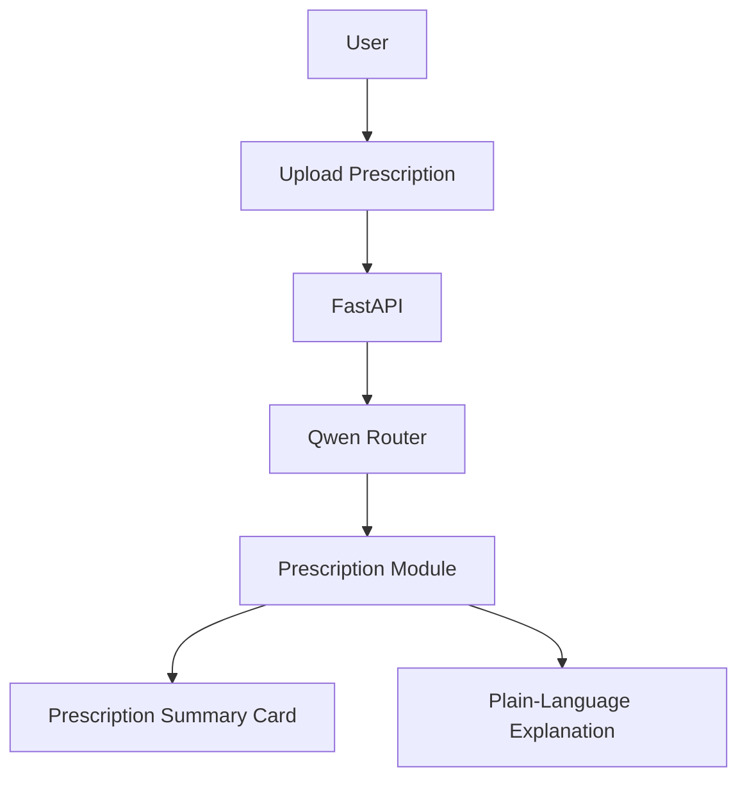

## Prescription Summary Card

```text
┌────────────────────────────────────┐
│ Prescription Analysis              │
├────────────────────────────────────┤
│ Medication:  __________             │
│ Dosage:      __________             │
│ Frequency:   __________             │
│ Duration:    __________             │
│                                    │
│ Confidence:  Medium                │
└────────────────────────────────────┘
```

## Visual Distinction

### Triage

Use:

- Urgency badge
- Red/amber warning banner
- Clear next action

### Prescription

Use:

- "Prescription Analysis" badge
- Medication summary card
- Extraction confidence
- Safety warning when applicable

Prescription results should be stored with their own audit schema.

**Estimated effort:** 2 days

---

# 9.7 Prescription-Specific Guardrails

## Required Disclaimer

Display this every time a prescription is analyzed:

> This is an automated analysis. Always verify with your pharmacist or prescriber. Do not change your medication routine based solely on this reading.

## Guardrail Checks

Verify:

- Required disclaimer is present
- Hardcoded safety warnings are prominent when triggered
- `medication_name` is populated
- Missing fields are explicitly identified
- User is asked to retake the photo when necessary
- Qwen has not over-interpreted the extraction
- Qwen has not introduced unsupported diagnoses
- The response remains consistent with the structured extraction

## Guardrail Flow

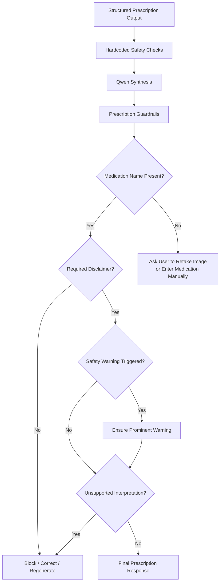

**Estimated effort:** 2 days

---

# Milestone 10 — All Features Integrated & Production-Hardened

**API:** `/v1/*` (triage + prescription + future modules, unified)

## Goal

Make triage and prescription reading work together without routing conflicts.

---

# 10.1 End-to-End Integration Tests

## Case 1 — Prescription Photo

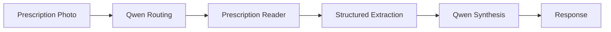

Expected result:

> Prescription Reader

---

## Case 2 — Symptom + Image

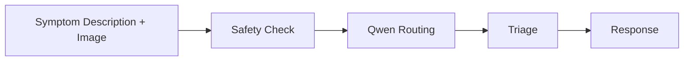

Expected result:

> Triage

---

## Case 3 — Emergency + Prescription

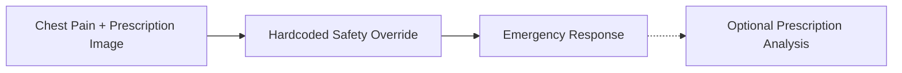

Expected result:

> Emergency path takes precedence.

---

## Case 4 — Clear Prescription Image With No Text

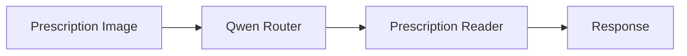

Expected result:

> Prescription Reader

---

# 10.2 Combined Evaluation

Create a shared evaluation harness capable of running:

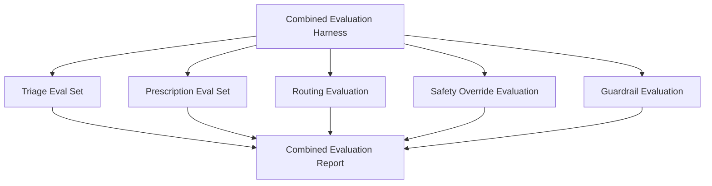

---

# 10.3 Performance Target

Initial target:

```text
Prescription image
        ↓
Image processing
        ↓
MedGemma extraction
        ↓
Safety checks
        ↓
Qwen synthesis
        ↓
Response

Target: < 3 seconds
```

Treat this as a performance goal rather than a safety requirement.

Quality, uncertainty handling, and safety take priority over raw latency.

---

# 10.4 Deployment

Confirm that quantized models can handle both modules within the target single-GPU memory budget.

Validate:

- GPU memory
- End-to-end latency
- Model quality
- Concurrent requests
- Stability
- Image processing overhead
- Specialist call overhead
- Qwen synthesis overhead

**Estimated effort:** 3–4 days

---

# Imaging Track — X-ray / CT (separate from `/v1`)

**API:** `/imaging/v1/...` — its own service, its own deploy pipeline, mounted on the shared gateway/auth/audit-log infra from Milestone 8.

## Goal

A higher-scrutiny module, decoupled from `/v1`'s fast release cadence.

## Build

- [ ] Regulatory/legal review of scope **before writing code** — this is the checkpoint that gates the rest of the track.
- [ ] Stand up MedGemma 27B (not the 4B tier) — imaging performance at 4B is meaningfully behind 27B on this specific task.
- [ ] Structured output schema for imaging findings, with a mandatory human-clinician-review flag before any result reaches a patient-facing view.
- [ ] Route the human-review gate through the shared frontend/gateway layer, not duplicated inside the imaging service — so it can't be bypassed by hitting `/imaging/v1/...` directly.
- [ ] Build an imaging-specific eval set (radiology benchmark data, e.g. MIMIC-CXR–style, plus institution-specific cases) and run a dedicated red-team pass, independent of every other module's eval work.
- [ ] Set up a separate deploy pipeline so this service can be held for review or re-training without affecting `/v1/*`.

## Viable System

An imaging capability that can clear its own regulatory bar on its own timeline, without triage/prescription/labs/interactions waiting on it — and without inheriting a "ship fast" cadence it shouldn't have.

**Estimated effort:** highly variable — regulatory review timeline dominates over build time here.

---

# Summary Table

| # | Track | Milestone | New Capability | API | Still Missing |
|---:|---|---|---|---|---|
| 1 | `/v1` | Talking Qwen | Basic chat | `/v1/chat` | Memory, medical grounding, triage, prescription |
| 2 | `/v1` | Multi-turn memory | Coherent conversation | `/v1/chat` | Medical grounding, triage, prescription |
| 3 | `/v1` | MedGemma + dumb routing | Clinically grounded specialist calls | `/v1/chat` | Real triage, reliable routing |
| 4 | `/v1` | Structured triage + red-flag override | Actual triage tool + deterministic safety floor | `/v1/triage` | Reliable routing, UI, logging |
| 5 | `/v1` | Function-calling routing | Context-aware specialist selection | `/v1/chat`, `/v1/triage` | UI, logging, prescription |
| 6 | `/v1` | Logging + web UI | Deployable, auditable demo | `/v1/*` | Prescription, hardening |
| 7 | `/v1` | Image input | Visual symptom triage | `/v1/triage` | Prescription, full hardening |
| 8 | `/v1` | Guardrails + eval + hardening | Supervised-pilot-ready triage system | `/v1/*` | Prescription |
| 9 | `/v1` | Prescription reading | Medication extraction + safety checking | `/v1/prescription` | Combined integration |
| 10 | `/v1` | Full integration | Complete multi-feature `/v1` system | `/v1/*` | Imaging |
| — | `/imaging/v1` | X-ray / CT | Higher-risk, higher-model-tier, own regulatory gate | `/imaging/v1/*` | — |

---

# Future Feature Modules

New capabilities should follow the same architectural pattern:

```mermaid
flowchart LR
    USER["User Request"]
    QWEN["Qwen Orchestrator"]
    MODULE["Task-Specific Module"]
    MED["MedGemma Specialist"]
    SCHEMA["Module Output Schema"]
    SAFETY["Hardcoded Safety Rules"]
    SYNTH["Qwen Synthesis"]
    RESPONSE["User Response"]

    USER --> QWEN
    QWEN --> MODULE
    MODULE --> MED
    MED --> SCHEMA
    SCHEMA --> SAFETY
    SAFETY --> SYNTH
    SYNTH --> RESPONSE
```

| Feature | Trigger | Specialist Model | Output Schema | Hardcoded Safety | API |
|---|---|---|---|---|---|
| **Lab Report Reading** | "Read my blood work" + image | MedGemma 1.5 | `{values: [{name, value, range, flag}], summary: str}` | Critical out-of-range values | `/v1/labs` |
| **Medication Interaction Check** | Multiple medications/images/text | MedGemma 1.5 | `{interactions: [{drug_a, drug_b, severity, description}], action: str}` | Known life-threatening interactions | `/v1/interactions` |
| **Discharge Summary Reading** | "Explain my discharge papers" + image | MedGemma 1.5 | `{diagnosis: str, medications: [], follow_up: str, precautions: []}` | Critical omissions / dangerous combinations | `/v1/discharge` |
| **X-ray / CT Interpretation** | Radiology image upload | MedGemma 27B | `{findings: [], impression: str, requires_clinician_review: true}` | Mandatory human review before patient-facing display | `/imaging/v1/scan` |

---

# Core Design Principles

## 1. Safety First

Hardcoded safety rules always run independently of model judgment.

```mermaid
flowchart TD
    INPUT["User Input"]
    SAFETY["Deterministic Safety Layer"]
    MODEL["LLM Pipeline"]
    OUTPUT["Final Response"]

    INPUT --> SAFETY
    SAFETY --> MODEL
    MODEL --> OUTPUT

    SAFETY -.->|"Can override"| OUTPUT
```

The model should never be the sole authority for emergency escalation.

---

## 2. Auditable

Every important specialist and orchestration decision should be reconstructable.

```mermaid
flowchart LR
    INPUT["User Input"]
    ROUTING["Routing Decision"]
    SPECIALIST["Specialist Call"]
    OUTPUT["Structured Specialist Output"]
    SAFETY["Safety Checks"]
    SYNTH["Qwen Synthesis"]
    RESPONSE["Final Response"]

    INPUT --> ROUTING
    ROUTING --> SPECIALIST
    SPECIALIST --> OUTPUT
    OUTPUT --> SAFETY
    SAFETY --> SYNTH
    SYNTH --> RESPONSE
```

Audit records should capture the relevant stages of this pipeline.

---

## 3. Task-Siloed

Every feature owns its:

- Prompt
- Output schema
- Safety rules
- Evaluation set
- Module identifier

This prevents the system from becoming one giant medical prompt.

```mermaid
flowchart TD
    INFRA["Shared Infrastructure"]

    TRIAGE["Triage Module"]
    RX["Prescription Module"]
    LAB["Lab Module"]
    INTERACTION["Interaction Module"]

    TRIAGE_PROMPT["Triage Prompt"]
    TRIAGE_SCHEMA["Triage Schema"]
    TRIAGE_EVAL["Triage Eval"]
    TRIAGE_SAFETY["Triage Safety"]

    RX_PROMPT["Prescription Prompt"]
    RX_SCHEMA["Prescription Schema"]
    RX_EVAL["Prescription Eval"]
    RX_SAFETY["Prescription Safety"]

    INFRA --> TRIAGE
    INFRA --> RX
    INFRA --> LAB
    INFRA --> INTERACTION

    TRIAGE --> TRIAGE_PROMPT
    TRIAGE --> TRIAGE_SCHEMA
    TRIAGE --> TRIAGE_EVAL
    TRIAGE --> TRIAGE_SAFETY

    RX --> RX_PROMPT
    RX --> RX_SCHEMA
    RX --> RX_EVAL
    RX --> RX_SAFETY
```

---

## 4. Orchestrator Decides

Qwen owns routing.

Specialist modules should not arbitrarily invoke one another.

```mermaid
flowchart TD
    QWEN["Qwen3-4B<br/>Orchestrator"]

    TRIAGE["Triage"]
    RX["Prescription"]
    LAB["Lab Reports"]
    INTERACTION["Medication Interactions"]

    QWEN --> TRIAGE
    QWEN --> RX
    QWEN --> LAB
    QWEN --> INTERACTION
```

This keeps the architecture predictable:

> **Orchestrator → Specialist → Structured Result → Synthesis**

rather than allowing specialists to create arbitrary chains.

---

## 5. Plain-Language Output

Specialists should return structured, machine-readable information.

Qwen converts that information into an understandable user-facing response.

```mermaid
flowchart LR
    MED["MedGemma"]
    STRUCTURED["Structured Clinical Output"]
    QWEN["Qwen3-4B"]
    RESPONSE["Plain-Language Response"]

    MED --> STRUCTURED
    STRUCTURED --> QWEN
    QWEN --> RESPONSE
```

This separation provides:

- Cleaner schemas
- Easier evaluation
- Better auditability
- Easier UI rendering
- Module-specific validation
- More controlled user-facing language

---

# Final System Architecture

```mermaid
flowchart TD
    USER["User<br/>Text + Optional Image"]

    UI["React / Next.js UI"]
    API["FastAPI Backend"]

    SAFETY["Hardcoded Safety Override"]
    EMERGENCY{"Emergency?"}
    EMERGENCY_RESPONSE["Emergency Response"]

    QWEN["Qwen3-4B<br/>Orchestrator"]

    ROUTER{"Module Selection"}

    TRIAGE["Symptom Triage /v1"]
    RX["Prescription Reading /v1"]
    LAB["Future: Lab Reports /v1"]
    INTERACTION["Future: Medication Interactions /v1"]
    IMAGING["X-ray / CT /imaging/v1"]

    MED["MedGemma 1.5 4B<br/>Multimodal Specialist"]
    MED27["MedGemma 27B<br/>Imaging Specialist"]

    STRUCTURED["Task-Specific<br/>Structured Output"]

    SPECIALIST_SAFETY["Module Safety Rules"]

    SYNTH["Qwen3-4B<br/>Plain-Language Synthesis"]

    GUARD["Output Guardrails"]

    RESPONSE["Final User Response"]

    DB[("PostgreSQL<br/>Sessions + Messages + Audit Logs")]
    OBS["Observability"]
    EVAL["Evaluation Harness"]

    USER --> UI
    UI --> API

    API --> SAFETY
    SAFETY --> EMERGENCY

    EMERGENCY -->|"Yes"| EMERGENCY_RESPONSE
    EMERGENCY -->|"No"| QWEN

    QWEN --> ROUTER

    ROUTER -->|"Triage"| TRIAGE
    ROUTER -->|"Prescription"| RX
    ROUTER -->|"Lab Report"| LAB
    ROUTER -->|"Medication Interaction"| INTERACTION
    ROUTER -->|"Imaging"| IMAGING

    TRIAGE --> MED
    RX --> MED
    LAB --> MED
    INTERACTION --> MED
    IMAGING --> MED27

    MED --> STRUCTURED
    MED27 --> STRUCTURED
    STRUCTURED --> SPECIALIST_SAFETY
    SPECIALIST_SAFETY --> SYNTH

    SYNTH --> GUARD
    GUARD --> RESPONSE

    RESPONSE --> UI

    API --> DB
    SAFETY --> DB
    QWEN --> DB
    MED --> DB
    SYNTH --> DB
    GUARD --> DB

    API -.-> OBS
    QWEN -.-> OBS
    MED -.-> OBS
    SYNTH -.-> OBS
    SAFETY -.-> OBS

    EVAL -.-> TRIAGE
    EVAL -.-> RX
    EVAL -.-> LAB
    EVAL -.-> INTERACTION
    EVAL -.-> ROUTER
    EVAL -.-> SAFETY
    EVAL -.-> GUARD
```

## Architectural Contract

The completed system follows this invariant:

```mermaid
flowchart LR
    A["User"]
    B["Safety Floor"]
    C["Qwen Orchestrator"]
    D["Task Module"]
    E["MedGemma Specialist"]
    F["Structured Output"]
    G["Module Safety"]
    H["Qwen Synthesis"]
    I["Output Guardrails"]
    J["User"]

    A --> B
    B --> C
    C --> D
    D --> E
    E --> F
    F --> G
    G --> H
    H --> I
    I --> J
```

**Qwen orchestrates.**

**MedGemma specializes.**

**Deterministic code owns the safety floor.**

**Each capability remains isolated behind its own module, schema, safety rules, and evaluation set.**

**Qwen converts structured specialist results into plain-language responses.**